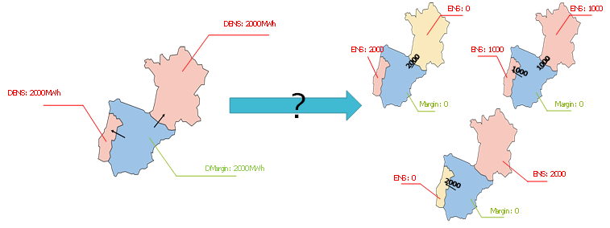
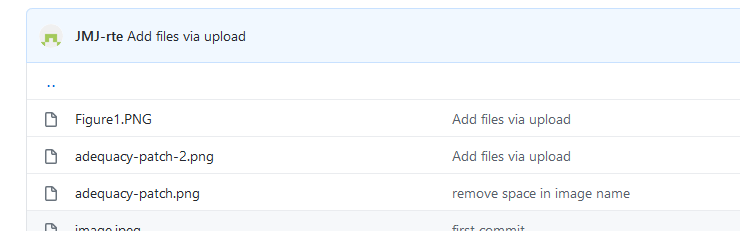

# Principes de l’adéquacy patch et règles associées 

Dans la suite du document, on introduit les variables suivantes :

•	ENS : Energy Not Served après échange ;

•	Margin : marges disponibles dans la zone après échange ;

•	DENS : Domestic Energy Not Served (défaillance qu’aurait la zone sans échange, correspondant au déséquilibre local)

•	Dmargin : Domestic Margin (marges disponibles dans la zone avant échange)

Il s’entend que pour une zone donnée à chaque instant les couples de variables (ENS, Margin) et (DENS, DMargin) comportent au moins une variable nulle.

## 2.1 Indétermination à lever :

