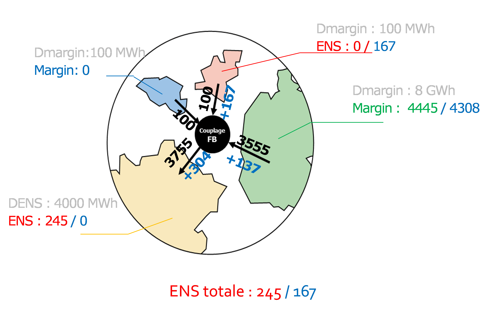

# Adequacy patch principles and associated rules

In the rest of the paper, the following variables are introduced:

* ENS: Energy Not Served (after an exchange);

* Margin: available margins in a zone after an exchange;

* DENS: Domestic Energy Not Served (a failure that the zone would have without exchange, corresponding to the local imbalance)

* Dmargin: Domestic Margin (available margin in the zone before exchanges)

For a given zone at every moment the variables couples (ENS, Margin) and (DENS, DMargin) each contain at least one null variable.

## Indeterminacy to be removed

*Figure 1: Indeterminacy of failure distribution without the adequacy patch*

In the shown example without adequacy patch, the 2000 MWh margins available in Spain before the exchanges can be arbitrarily used to reduce all or part of the local failures in France and Portugal. We show three economically equivalent propositions for Antares below (from left to right, then up to down):

    1. Absorb the failure in France;
    2. Absorb 50% of the failures in France and Portugal;
    3. Absorb the failure in Portugal.

The second solution should be fostered by the adequacy patch. It is penalizing in terms of the number of failure hours - since it maintains both France and Portugal in failure.

## Local Matching rule
### NTC borders case

{: style="height:400px;"}

*Figure 2: Considering the Local Matching rule on NTC borders*

The first rule followed by the adequacy patch is “Local Matching” which, imposes on a locally unbalanced country (DENS > 0, DMargin = 0) to not accentuate its imbalance and thus to globally be an importer. By extent, this rule leads to forbid a non-locally unbalanced country (DENS = 0, DMargin >= 0) to be put in failure and thus, it respects after exchange (ENS = 0, Margin >= 0). 

In the shown example, if France exports 1700 MWh to Spain, and Spain exports 1700 MWh to Portugal (Figure 2), France would voluntarily put itself in failure to partially absorb Portugal’s failure via transit through Spain. This exchange does not conform to the rule, and France can thus only export 1500 MWh towards Spain, which can only export 1500 MWh towards Portugal. 

With NTC links (independent exchange capacity for each link), like the ones considered in the example, the Antares “hurdle costs” should foster this rule since the two graphical solutions are equivalent in terms of global failure (510 MWh). However, the first increases by 200 MWh the transit between France and Spain, and between Spain and Portugal, which increases the total system cost. 

### Flow-Based borders case

In the case of a Flow-Based domain, Antares' objective is to minimize the global failure on the domain, to maximize the exports of zones with margins without necessarily respecting the "Local Matching" rule.

*Figure 3: Minimization of the global failure, incompatible with the local matching*

As shown in the example, it will lead Antares to choose the blue solution which maximizes Germany's exports. However, by increasing Germany's exports by +137 MWh, the Flow-Based constraints lead to an increase of +167 MWh in the Netherlands' exports, which is then in failure. These two exports benefit France which suppresses its failure with +304 MWh of imports. Putting the Netherlands into failure does not conform with the "Local Matching" rule and post-adequacy patch. The chosen flows are the black-colored ones, now a 245 MWh failure in France, against a 167 MWh one in the Antares output. In the context of the adequacy patch, it is not allowed to modify the production plan of any zone - Germany's 137 MWh of export reduction converts inro a 137 MWh spillage in Germany. 

**This is a deoptimization induced by the decoupled execution of the Adequacy Patch that can only be resolved by a coupled calculation using Antares.** Subsequently, a filter will be proposed to remove the deoptimizations beyond a threshold to be defined.

## Curtailment Sharing rule

Unlike the previous rule which must be strictly adhered to, this rule is an incentive to respect, as much as possible, the observed failure ratios.

*Figure 4: Distribution of the failure, conform to the observed failure ratios*

In the case mentioned in the chapter “Indeterminacy to be removed” - in order to remove indeterminacy sometimes induced on the distribution of a failure, an additional rule in the form of an incentive (via penalties) is applied. This rule will lead, between two otherwise equivalent solutions, to a focus on the solution ensuring compliance with the failure ratio observed. Concretely, it means reducing the DENS found in different countries by the closest ratio possible without entirely canceling out the failure in any country. 

In the shown example, Spain's margins (1100 MWh before exports) must be distributed between 100 MWh export towards Portugal and 1000 MWh towards France. Thus, Portugal and France reduce their local failure by 50% each, but they both retain some failure, while Spain could have absorbed Portugal’s total failure.

**By construction, this rule will naturally widely increase the number of countries simultaneously in failure and thus the LOLE on those different countries.**
