# Rédiger sur Github.com
## Modifier une documentation

- allez sur le repo github dans le dossier `docs` [lien ici](https://github.com/AntaresSimulatorTeam/antares-doc/tree/master/docs).

- connectez vous avec votre compte 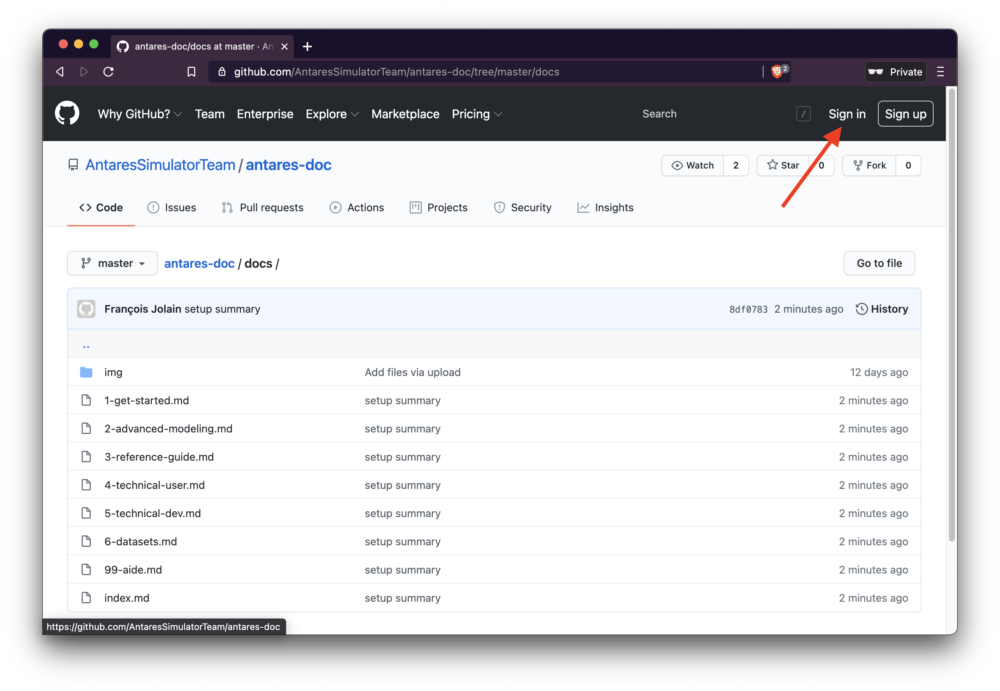

- selectionnez votre fichier à modifier 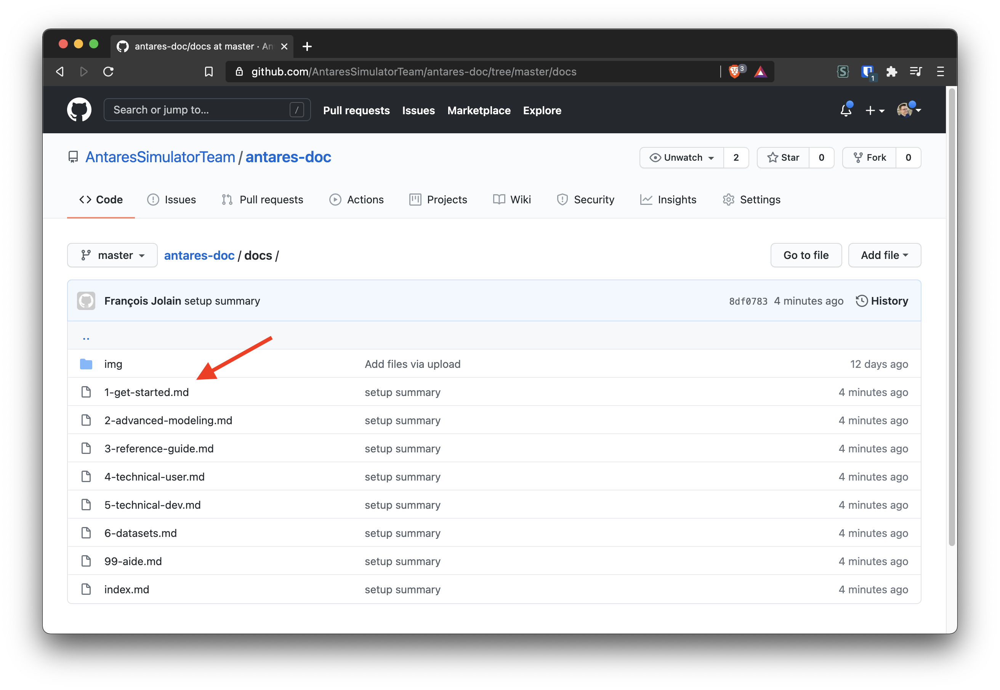

- démarrez l'éditeur 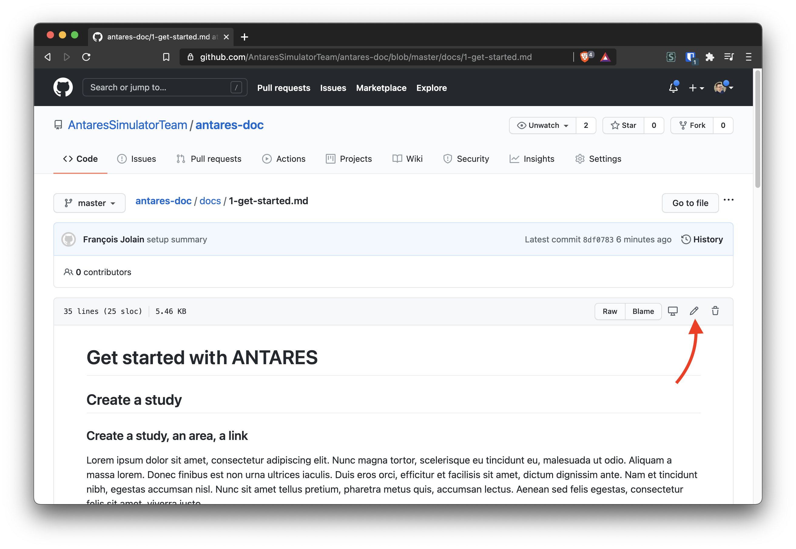

- Modifiez le fichier en ajoutant du markdown 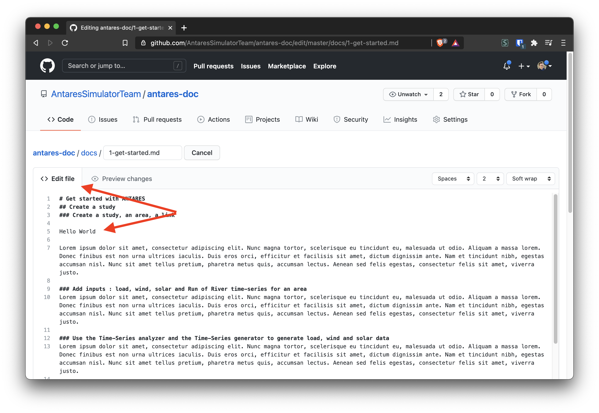

- Faire un rendu *partiel* : **Github propose un rendu à l'exception du LaTeX.** 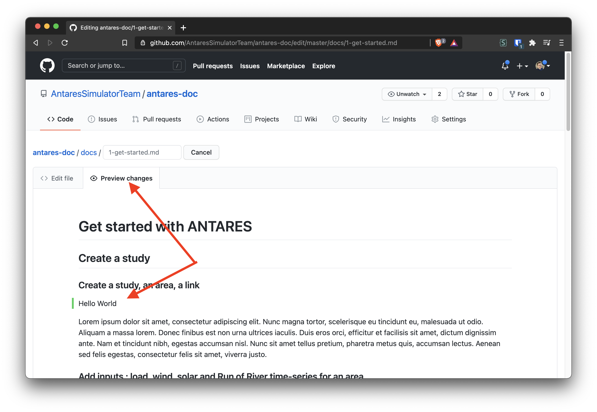

- Sauvegardez les changements à l'aide du menu en bas de page 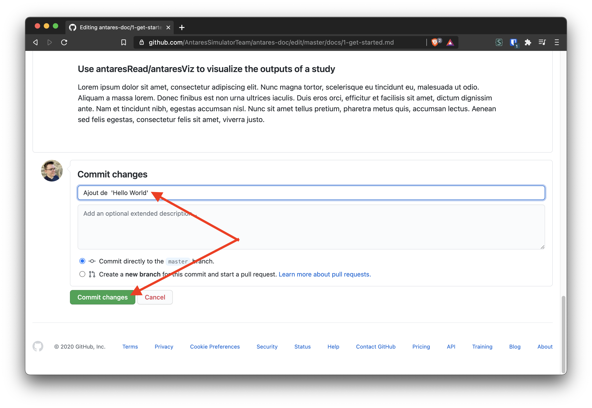

- Voir le rendu *final* : après quelques minutes, le site devrait se mettre à jour [lien ici](https://antares-doc.readthedocs.io/en/latest/) 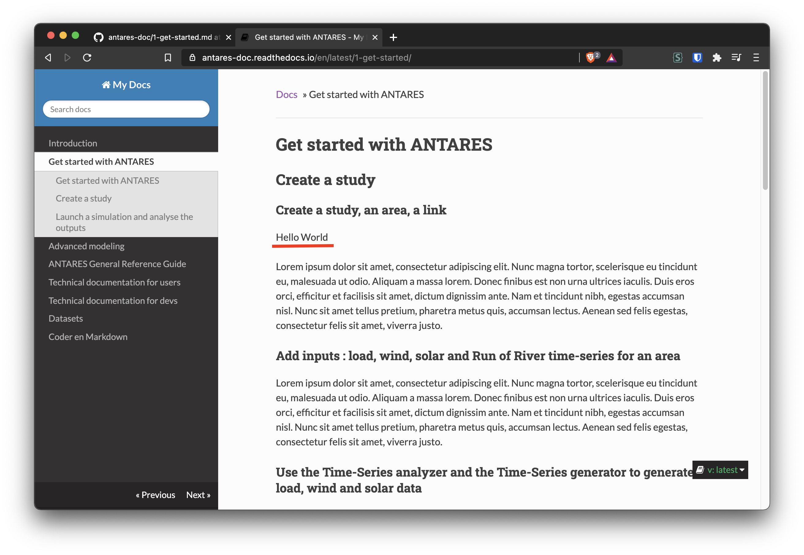

## Ajouter une image

- allez sur le repo github dans le dossier `docs` [lien ici](https://github.com/AntaresSimulatorTeam/antares-doc/tree/master/docs).

- connectez vous avec votre compte 

- une fois dans le dossier contenant votre page à modifier, cliquez sur Add file et selectionnez votre image sur votre ordinateur 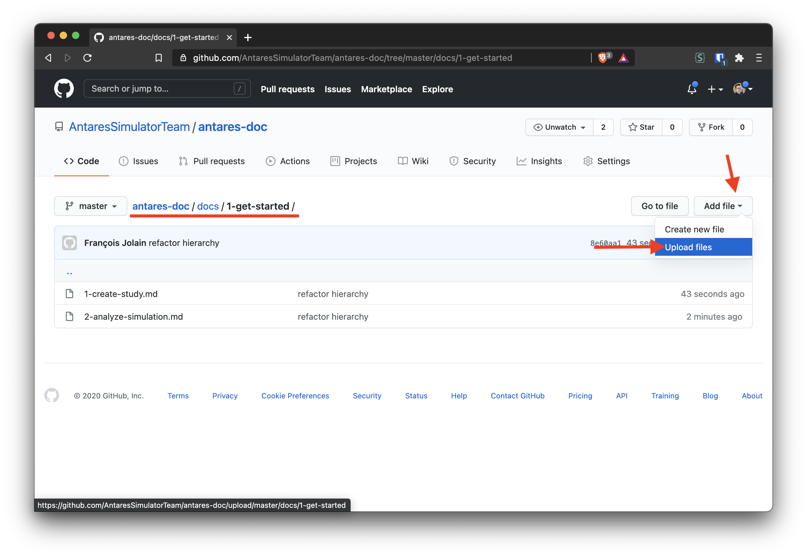

- choisissez vos images sur votre ordinateurs. Elles devraient apparaître en dessous. Puis valider le téléchargement en appuyant sur le bouton commit 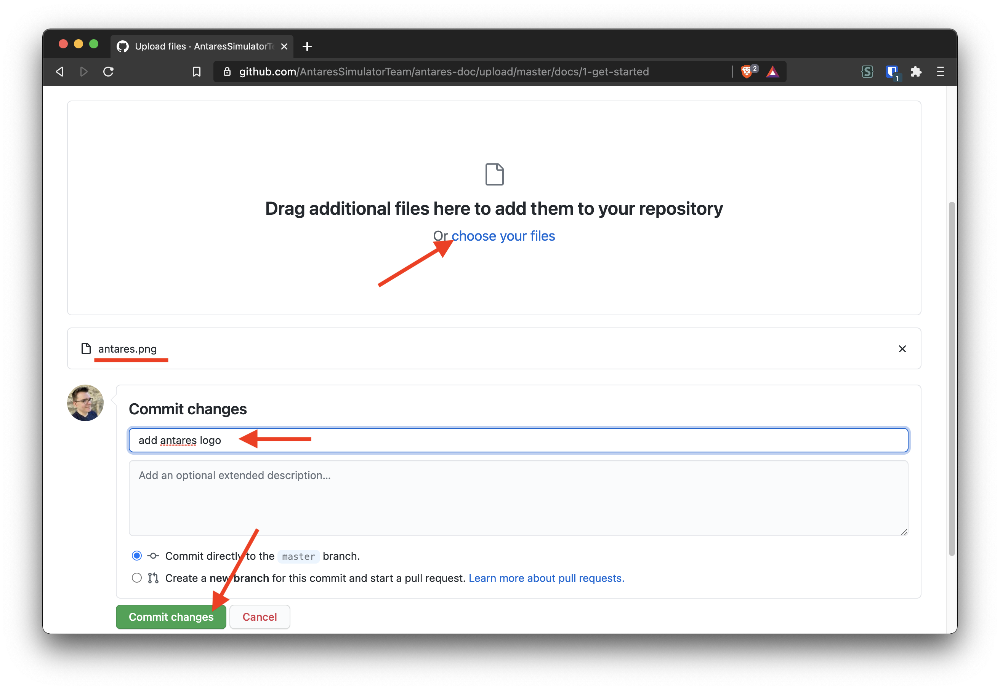

- Retourner dans le dossier contenant votre page à modifier. Les images devraient être ajoutée. 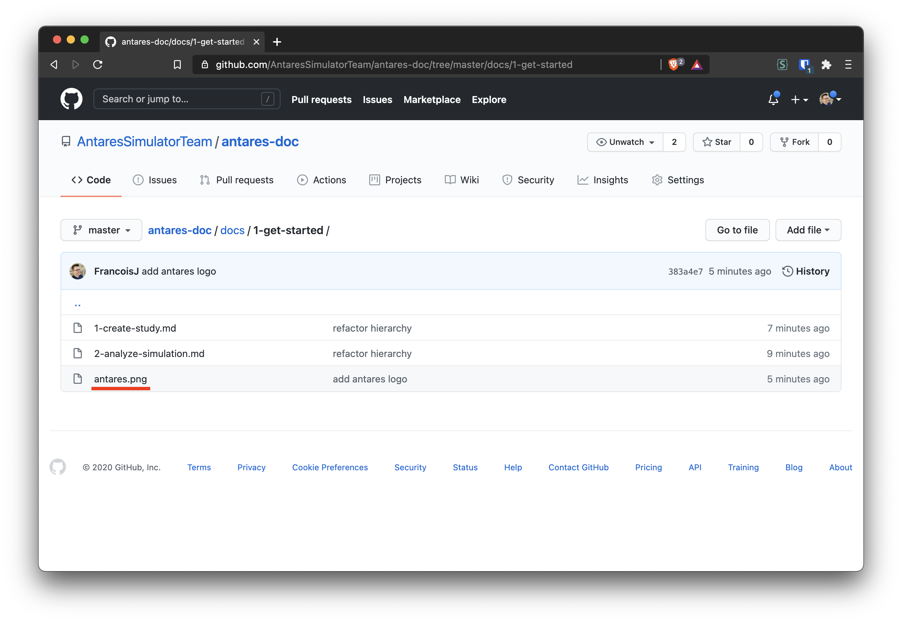

- Vous pouvez maintenant ajoutez l'image dans votre doc à l'aide de la syntax markdown `` 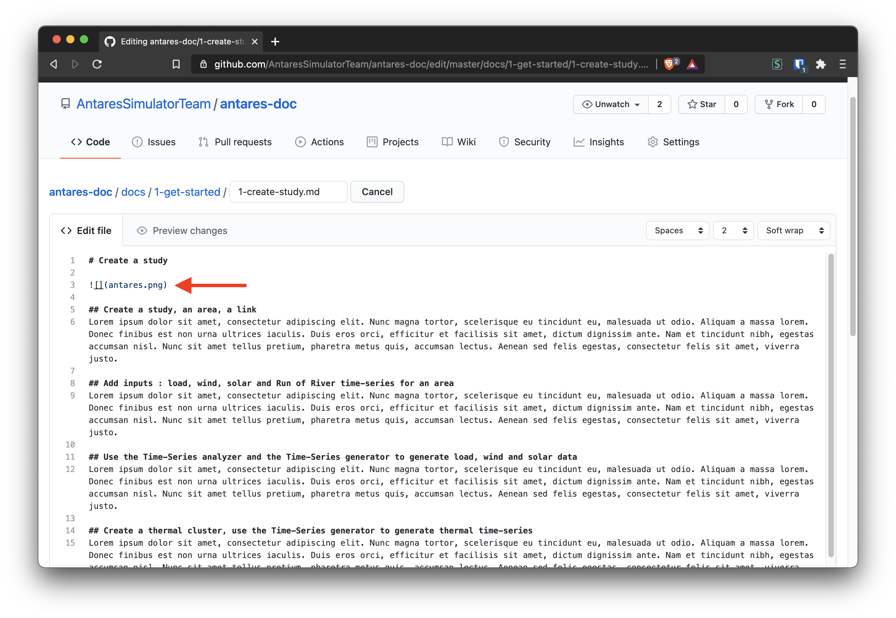

- Le rendu partiel, final et la sauvegarde se passent comment vu plus haut.