# First steps

## Opening Antares Web

One you have installed Antares you should have a window similar to this one:

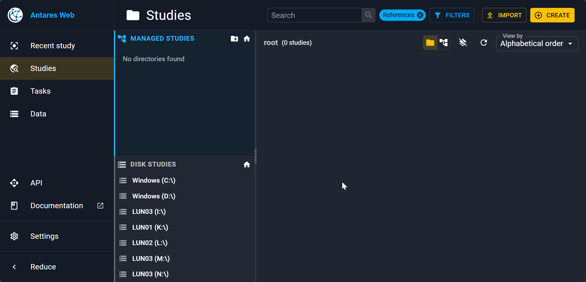

On the left, you have a collapsable sidebar to go to your last study, explore studies, manage simulation tasks, a common data page to mutualise some data accross studies...

By default you will be on the **Studies** view where you have:

- Managed studies and on disk studies (see the differences [here](../tutorials/data-management.md)).
- A view of your studies inside the right panel. We are yet to import a study!

## Importing a study

As an example, let's import a real world study: the 2024 TYNDP study [available on zenodo](https://zenodo.org/records/18183650). Once the zip file downloaded, click the **Import** button in the top right. Then, drag and drop the zip or click on the pop up to open the file explorer. Importation may take some time.

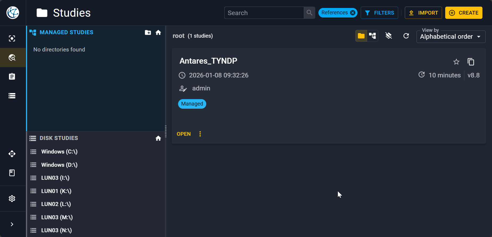

!!! note

    You can rename your study by clicking on :material-dots-vertical: **More action** and then on **Properties**.

## Study informations

By clicking on the study, you find have a first window with an overview of it.

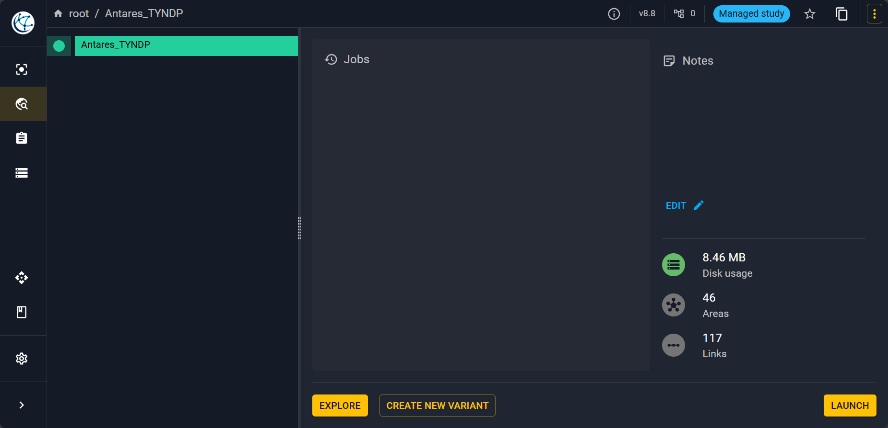

On this view, you can find:

- A [study variant](../tutorials/create-variant.md) tree on the left.
- The list of jobs that is to say the simulations launched.
- Some comments that you can make on the study and some basic information.

## Exploring the study

To open the study click on **Explore** it will open the following view.

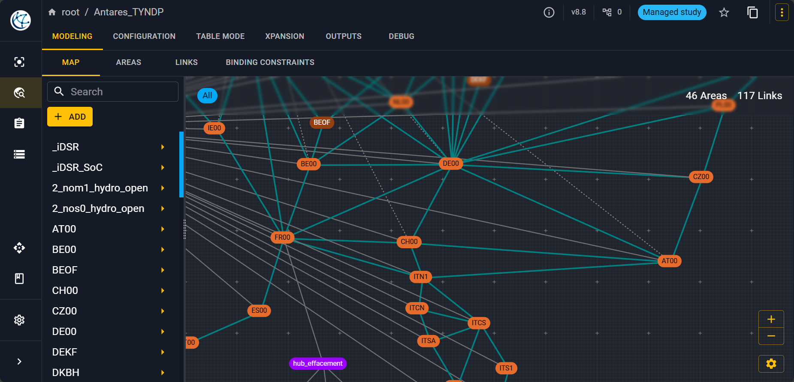

### Map

You have first a visualization of the graph of your modellisation with each node corresponding to an [area](../reference/area.md) that can be physical or not. Nodes are connected with [links](../reference/link.md). You can view what properties are associated to each area (resp. link) inside the **Areas** (resp. **Links**) tab.

### Areas

For example here is what you get when you click on **Areas** and then select the zone `FR00` on the left corresponding to France.

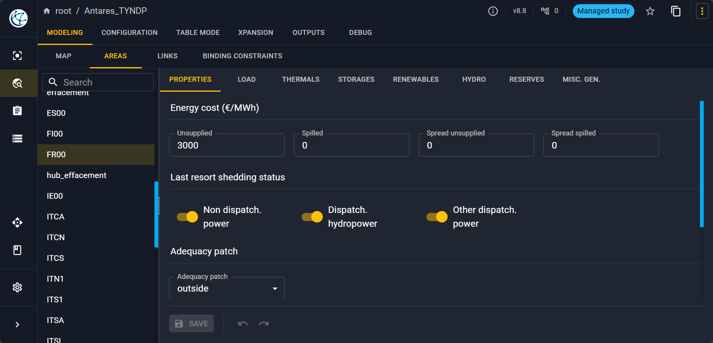

Inside an area, you can define different fundamental object of modelling built in within Antares:

- The [electrical consumption](../reference/load.md) of the node in the **Load** tab.
- [Thermal clusters](../reference/thermals.md) inside the **Thermals** tab (nuclear, gas, lignite...).
- Some [short-term storages](../reference/storages.md) inside the **Storages** tab.
- [Renewable clusters](../reference/renewables.md) (mainly solar and wind production) inside the **Renewables** tab.
- Some [hydraulical generation and long term storages](../reference/hydro.md) inside the **Hydro** tab.
- The properties of [reserves](../reference/reserves.md) inside the **Reserves** tab (primary, strategic...). 
- And other [miscellanous generation](../reference/misc-gen.md) inside the **Misc. gen.** tab.

### Links

And for the link between France and the United Kingdom.

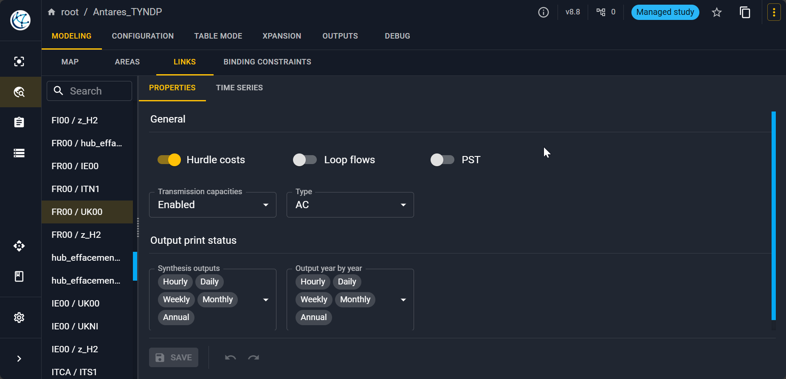

### Configuration

In the **Configuration** tab you have multiple views to select all the parameters that you want to set for the simulation.

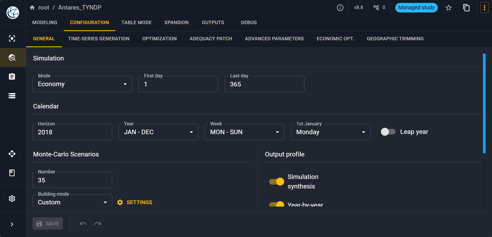

## Launching a simulation

To launch the simulation, you have to click on the :material-dots-vertical: button in the top right and then click on :material-lightning-bolt: **Launch**. A pop-up will open:

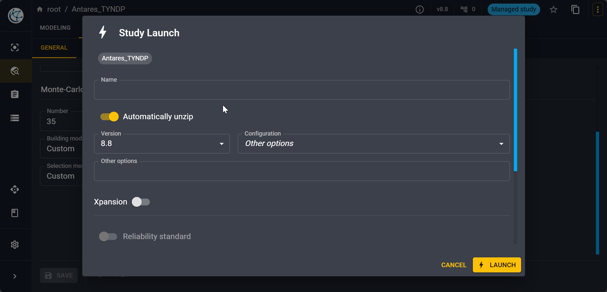

Select the version of the simulator you want to use among those you have on your installation. 

!!! note

    You can check the state of your simulation in :material-clipboard-text: **Tasks** view on the side bar.

## Outputs of the simulation

!!! note

    On a personal computer equiped with Antares Desktop, an 11th gen intel core i5 and 16 Gb of RAM, the simulation took about 25 minutes.

### Data

Once the simulation is finished you can go to the **Output** tab. You have there the list of all your outputs.

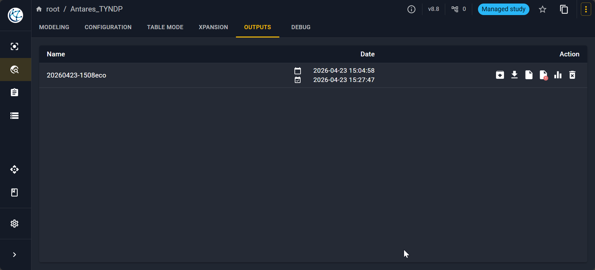

For example for the area corresponding to France you can view results.

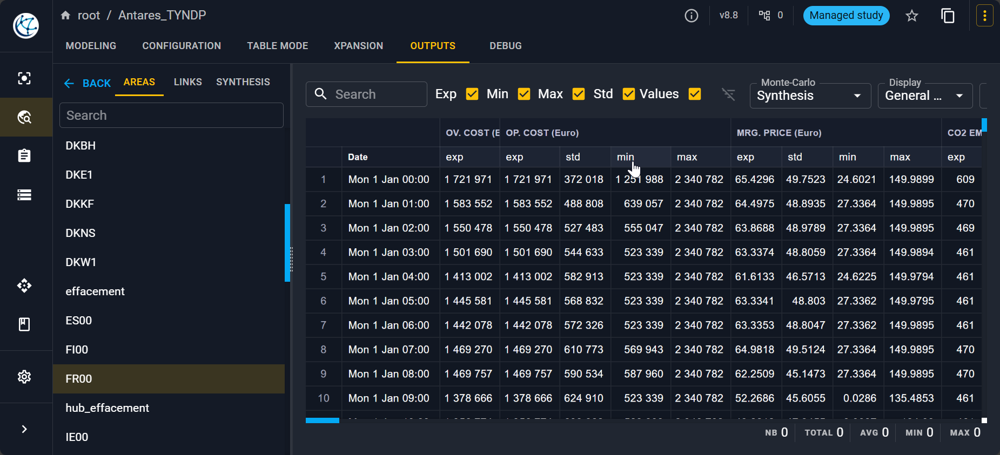

You can view results per area, per link and also have some synthesis.

### Other insights: logs, errors and digest

Sometimes it is interesting to view the logs and understand what went wrong during the simulation. You can click in the output list on the different icons highlighted below to get information about logs, errors and digest.

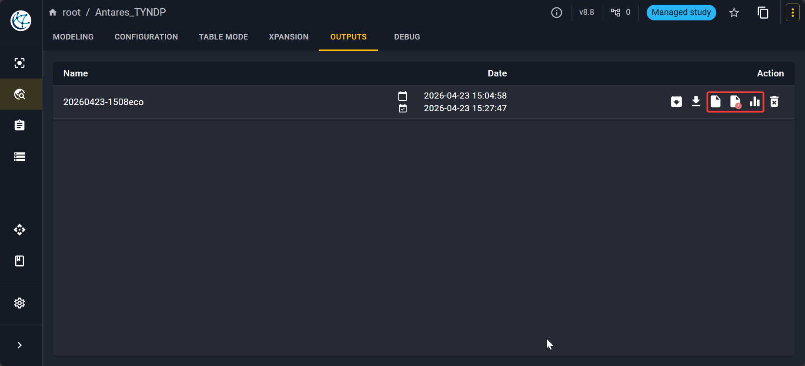

## Other tabs: Table Mode, Xpansion, Debug

You can find more information on these tabs in the following pages:

- [Table mode](../tutorials/use-table-mode.md)
- [Xpansion]()
- [Debug](../tutorials/debug-your-study.md)
