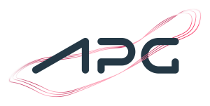
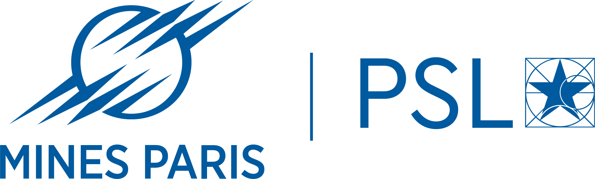

  
  

    <h1 style="margin: 0;">Antares</h1>
    

      Powering decisions on tomorrow's energy systems
    

  

Antares is an open source software suite designed to simulate electrical power systems. 
Its goals are to:

- Provide insight into the evolution trajectories of electricity mix
- Identify key levers to ensure security of supply
- Highlight necessary grid developments to support transformations in the electricity system

Thus, Antares is used for [medium and long-term studies](overview/use-cases.md#reports-using-antares).

## Key features

Backed by the french transmission system operator [RTE](https://www.rte-france.com/en/home), 
Antares is an industry grade software.

-   :material-monitor-dashboard:{ .lg .middle } **Intuitive interface**

    ---

    [Modern UI](getting-started/first-steps.md) for checking and visualizing studies.

-   :material-lightning-bolt:{ .lg .middle } **Blazing-fast C++ simulation engine**

    ---

    Built for [optimal energy dispatch](https://github.com/AntaresSimulatorTeam/Antares_Simulator) 
    and [investment strategy](https://github.com/AntaresSimulatorTeam/antares-xpansion).

-   :material-console:{ .lg .middle } **Scriptable Python automation**

    ---

    [Automation framework](programmatic/antares-craft-overview.md) to fit your own workflow 
    and to automate tasks.

-   :material-vector-link:{ .lg .middle } **Open, interoperable energy models**

    ---

    Alongside built-in optimized models, Antares will soon fully support 
    [generic GEMS models](https://gems-energy.readthedocs.io/en/latest/).
    

## User community

This software is already used by multiple TSO, companies and universities including :

  

    
  

  

    
  

  

    
  

  

    
  

  

    
  

  

     
  

  

    
  

  

    
  

## Open source

We believe that open source software is essential in achieving 
the transformation of tomorrow's energy challenges, transparently and collaboratively. 

Therefore, all Antares technical components are licensed under 
[MPL 2.0](https://www.mozilla.org/en-US/MPL/2.0/) apart from 
[Antares Web](https://github.com/AntaresSimulatorTeam/AntaREST) licensed under 
[Apache 2.0](https://www.apache.org/licenses/LICENSE-2.0).
Antares will remain open source for the years to come. 

We would love to hear from you! Feedback, issues and [contributions](./contributing/index.md) 
are welcomed on GitHub.

[Roadmap :octicons-goal-24:](overview/roadmap.md){ .md-button }