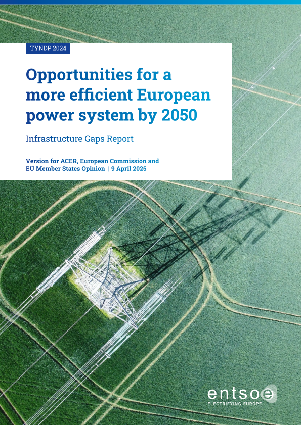
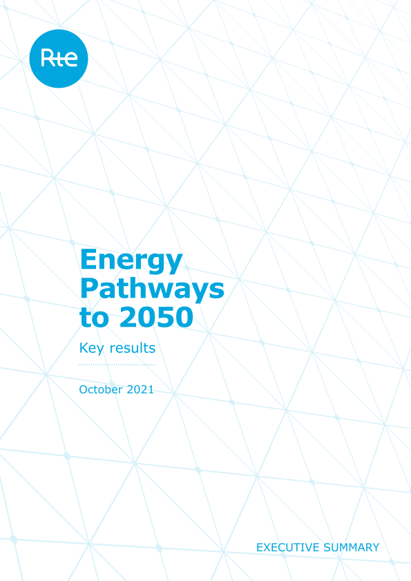
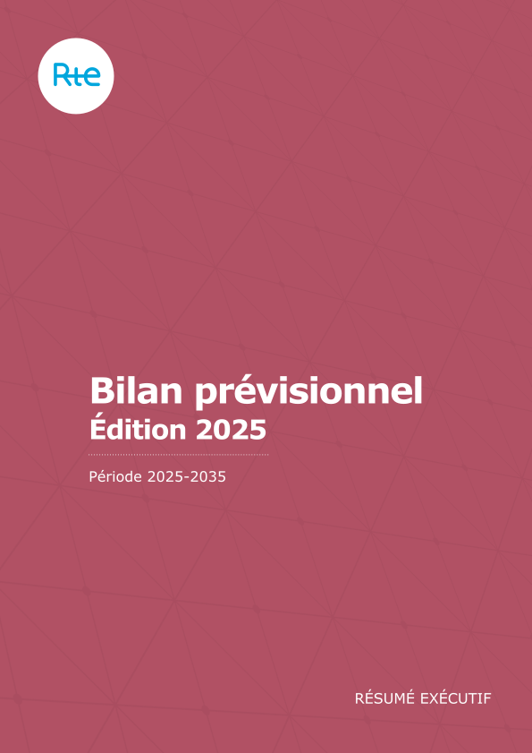

# Use cases

## Main objectives

In terms of power studies, the different fields of application Antares has been designed for are the following :

- **Generation adequacy problems:** assessment of the need for new generating plants so as to keep the security of supply above a given critical threshold. 

- **Transmission project profitability:** assessment of the savings brought by a specific reinforcement of the grid, in terms of decrease of the overall system generation cost (using an assumption of fair and perfect market) and/or improvement of the security of supply (reduction of the loss-of-load expectation).

- **Generation and transmission expansion planning:** rough assessment of the location and consistency of profitable reinforcements of the generating fleet and/or of the grid at a given horizon, on the basis of relevant reference costs and taking into account feasibility local constraints (bounds on the capacity of realistic reinforcements).

## Reports using Antares

Antares is used by TSO and institutions for energy planning and decarbonation pathways. 
Here are some reports that used Antares:

Antares is also used in the academic world for peer-reviewed articles and is
undergoing active research and development 
[:material-open-in-new:](../reference/bibliography.md){target="_blank"}.

## What does Antares do and doesn't do ?

Antares models an aggregated grid and thus can't account for a detailed view of your area.
Moreover, to have a fast conputation time per time step, Antares only consider a static regime 
with DC assumptions. 

The goal of Antares is to give an optimized dispatch with a centralized planner 
with 1-hour time steps. So it cannot represent actor strategies.

You can see more of the underlying hypothesis [here](../reference/hypothesis.md).

