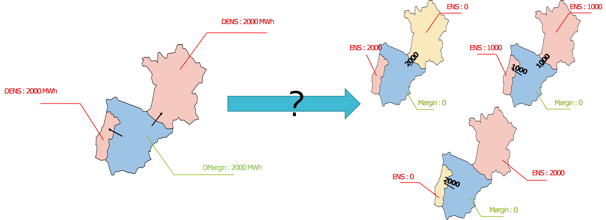
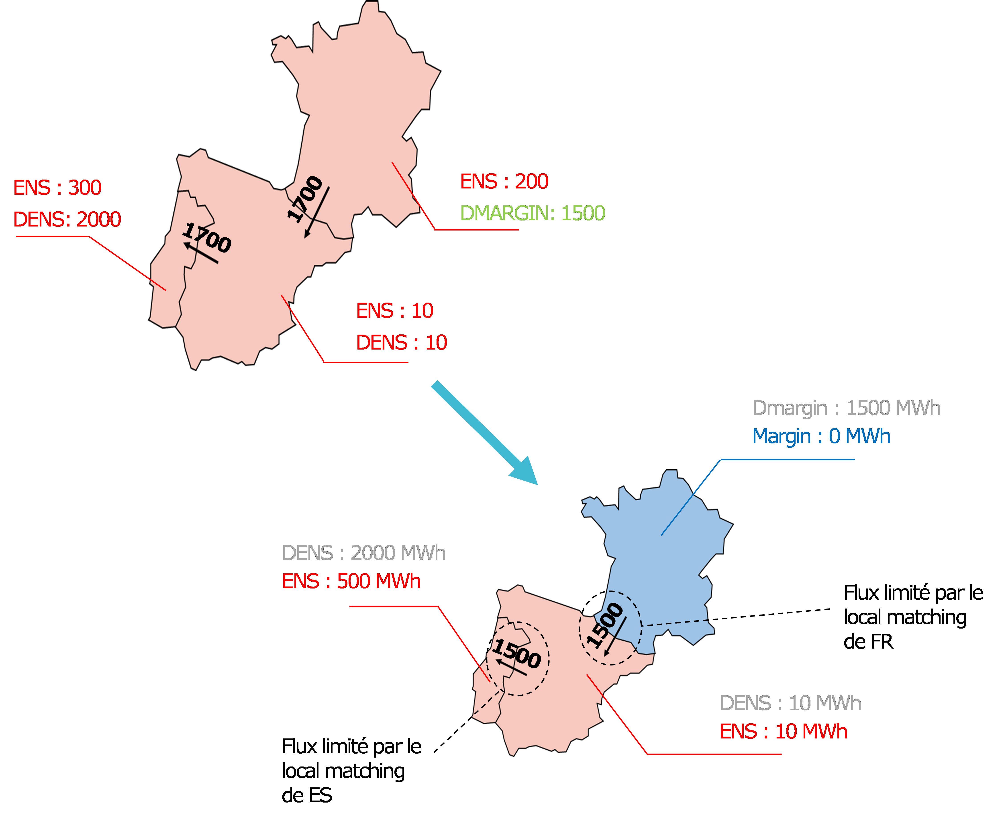
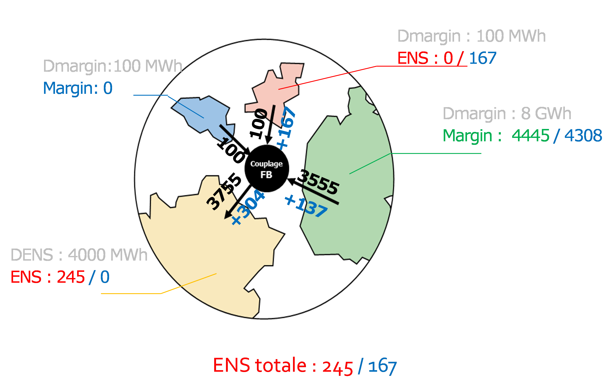
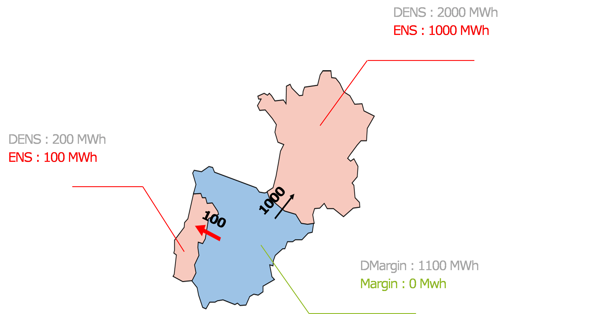

# Principes de l’adéquacy patch et règles associées 

Dans la suite du document, on introduit les variables suivantes :

* ENS : Energy Not Served après échange ;

* Margin : marges disponibles dans la zone après échange ;

* DENS : Domestic Energy Not Served (défaillance qu’aurait la zone sans échange, correspondant au déséquilibre local)

* Dmargin : Domestic Margin (marges disponibles dans la zone avant échange)

Il s’entend que pour une zone donnée à chaque instant les couples de variables (ENS, Margin) et (DENS, DMargin) comportent au moins une variable nulle.

## Indétermination à lever

*Figure 1 : Indétermination de la répartition de la défaillance en l’absence d’adéquacy patch*

Dans l’exemple présenté, en l’absence d’adéquacy patch, les 2000 MW de marges disponibles en Espagne avant échange peuvent arbitrairement concourir à réduire tout ou partie de la défaillance locale constatée en France ou au Portugal.  On présente 3 propositions équivalentes économiquement pour Antares (de gauche à droite puis de haut en bas) :

    1. Résorber la défaillance de la France ;
    2. Résorber 50% de la défaillance en France et au Portugal ;
    3. Résorber la défaillance au Portugal.

La solution 2 devrait être celle favorisée par l’adéquacy patch, elle est pénalisante en terme de nombre d’heures de défaillance puisqu‘elle maintient à la fois la France et le Portugal en défaillance.

## Règle de Local Matching
### Cas de frontières NTC

{: style="height:400px;"}

*Figure 2 : Prise en compte de la règle de Local Matching sur frontières NTC*

La première règle à respecter par l’adéquacy patch est celle dit du « Local Matching ». Cette règle consiste à imposer à un pays qui est localement déséquilibré (DENS > 0, DMargin = 0) de ne pas accentuer son déséquilibre et donc d’être globalement importateur. Par extension, cette règle conduit à interdire à ce qu’un pays qui n’est pas localement déséquilibré (DENS = 0, DMargin >= 0) ne soit pas mis en défaillance et respecte donc après échange (ENS = 0, Margin >= 0).

Dans l’exemple présenté, si la France exporte 1700 MW vers l’Espagne, et l’Espagne exporte 1700 MW vers le Portugal (graphe du haut) alors la France se mettrait volontairement en défaillance pour résorber en partie la défaillance du Portugal via un transit par l’Espagne. Cet échange n’est pas conforme à la règle et la France ne peut donc exporter que 1500 MW vers l’Espagne, qui à son tour ne peut exporter que 1500 MW vers le Portugal.

Avec des liens NTC (capacité d’échange indépendante pour chaque lien), comme ceux considérés dans l’exemple, les « hurdle costs » (coûts de transit) d’Antares devraient favoriser la prise en compte de cette règle car les solutions des 2 graphes sont équivalentes en termes de défaillance globale (510 MW) mais la première augmente de 200 MW le transit entre la France et l’Espagne et entre l’Espagne et le Portugal, ce qui augmente le coût total du système.

### Cas de frontières Flow-Based

Dans le cas d’un domaine Flow-Based, l’objectif d’Antares qui est de minimiser la défaillance globale sur le domaine, conduira à maximiser les exports des zones disposant de marges, sans nécessairement respecter la règle dite de local matching.

*Figure 3 : Minimisation de la défaillance globale, incompatible avec le local matching*

Dans l’exemple présenté, cela conduira Antares à retenir la solution en bleue qui permet de maximiser les exports de l’Allemagne. Toutefois en augmentant les exports de l’Allemagne de +137 MW, les contraintes Flow-Based conduisent à augmenter de +167 MW les exports des Pays-Bas qui se trouvent alors en défaillance. Ces 2 exports bénéficient à la France qui avec +304 MW d’import supprime sa défaillance. La mise en défaillance des Pays-Bas n’est pas conforme à la règle de local matching et post-adéquacy patch, les flux retenus sont ceux en noir, maintenant une défaillance en France de 245 MW, contre 167 MW en sortie d’Antares. Ne nous autorisant pas à modifier le plan de production d’une quelconque zone dans le cadre du calcul d’adéquacy patch, les 137 MW de réduction d’export de l’Allemagne sont convertis en 137 MW de spillage en Allemagne. 

**Il s’agit là d’une désoptimisation induite par l’exécution découplée de l’Adéquacy Patch qui ne pourra être résorbée que par un calcul couplé avec Antares.** Par la suite, on proposera un filtre pour supprimer les désoptimisations au-delà d’un seuil à définir.

## Règle de Curtailment Sharing

Contrairement à la règle précédente qui doit être strictement respectée, cette règle est une incitation à respecter dans la mesure du possible les ratios de défaillance constatés.

*Figure 4 : Répartition de la défaillance conforme aux ratios de défaillance constatés*

Dans le cas déjà évoqué au chapitre "Indétermination à lever", pour lever l’indétermination parfois induite sur la répartition de la défaillance, une règle supplémentaire sous forme incitative (via des pénalités) conduit, entre 2 solutions équivalentes par ailleurs, à privilégier celle qui assure le meilleur respect du ratio de défaillance observé. Concrètement, cela revient à réduire la DENS constatée dans des différents pays d’un ratio le plus proche possible, sans annuler totalement la défaillance dans aucun des pays.

Dans l’exemple présenté, les marges de l’Espagne (1100 MWh avant export) doivent ainsi être réparties entre 100 MWh d’export vers le Portugal et 1000 MWh vers la France. Ainsi, le Portugal comme la France, réduisent chacun de 50% leurs déséquilibres locaux, … mais conservent chacun de la défaillance, alors que l’Espagne aurait pu résorber la défaillance du Portugal.

**Par construction, cette règle va naturellement largement augmenter le nombre de pays simultanément en défaillance et donc la LOLE sur ces différents pays.**
