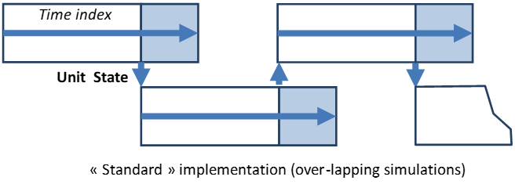
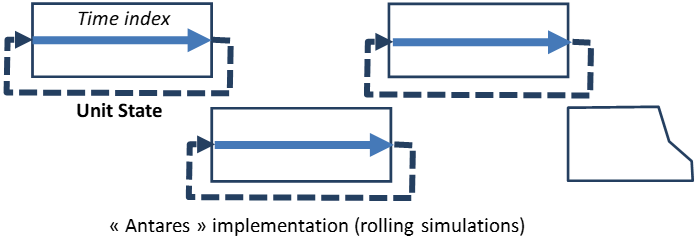

# Advanced parameters

## Seeds for random number

Defining random seeds allow to control random number generation for
time series generation, noise (used to eliminate equivalent solution during
the optimization) or reservoir levels.

#### Initial reservoir levels

enum
**DEPRECATED since 9.2** The reservoir level is now always determined with
cold start behavior. Simulations results may in some circumstances be heavily
impacted by this setting, hence proper attention should be paid to its meaning
before considering changing the default value.

- `cold start`
- `hot start`

??? info "Cold vs. hot start"

    This parameter is meant to define the initial reservoir levels that should
    be used, in each system area, when processing data related to the
    hydropower storage resources to consider in each specific Monte-Carlo year.

    As a consequence, Areas which fall in either of the two following
    categories are not impacted by the value of the parameter:

    - No hydro-storage capability installed
    - Hydro-storage capability installed, but the "reservoir management"
      option is set to `false`.

    Areas that have some hydro-storage capability installed and for which
    explicit reservoir management is required are concerned by the parameter.
    The developments that follow concern only this category of Areas.

    **Cold Start**

    On starting the simulation of a new Monte-Carlo year, the reservoir level
    to consider in each Area on the first day of the initialization month is
    randomly drawn between the extreme levels defined for the area on that day.

    - The value is drawn according to the probability distribution function of
      a "Beta" random variable, whose four internal parameters are set so as to
      adopt the following behavior:
        - Lower bound: Minimum reservoir level.
        - Upper bound: Maximum reservoir level
        - Expectation: Average reservoir level
        - Standard Deviation: (1/3) (Upper bound-Lower bound)

    - The random number generator used for that purpose works with a dedicated
      seed that ensures that results can be reproduced from one run to another,
      regardless of the simulation runtime mode (sequential or parallel) and
      regardless of the number of Monte-Carlo years to be simulated.

    **Hot Start**

    On starting the simulation of a new Monte-Carlo year, the reservoir level
    to consider in each Area on the first day of the initialization month is
    set to the value reached at the end of the previous simulated year, if
    three conditions are met:

    The simulation calendar is defined throughout the whole year, and the
    simulation starts on the day chosen for initializing the reservoir levels
    of all Areas.

    The Monte-Carlo year considered is not the first to simulate, or does not
    belong to the first batch of years to be simulated in parallel. In
    sequential runtime mode, that means that year #N may start with the level
    reached at the end of year $N-1$. In parallel runtime mode, if the simulation
    is carried out with batches of B years over as many CPU cores, years of
    the $k$-th batch 3 may start with the ending levels of the years processed
    in the $(k-1)$-th batch.

    The parallelization context must be set to ensure that the $M$
    Monte-Carlo years to simulate will be processed in a round number of $K$
    consecutive batches of $B$ years in parallel

    The first year of the simulation, and more generally years belonging to
    the first simulation batch in parallel mode, are initialized as they
    would be in the cold start option.

    !!! note

        Depending on the hydro management options used, the amount of
        hydro-storage energy generated throughout the year may either match
        closely the overall amount of natural inflows of the same year, or
        differ to a lesser or greater extent. In the case of a close match,
        the ending reservoir level will be similar to the starting level. If
        the energy generated exceeds the inflows (either natural or pumped),
        the ending level will be lower than the starting level (and conversely,
        be higher if generation does not reach the inflow credit). Using the
        `hot start` option allows to take this phenomenon into account in a
        very realistic fashion, since the consequences of hydro decisions
        taken at any time have a decisive influence on the system's long term
        future.

        When using the reservoir level `hot start` option, comparisons
        between different simulations make sense only if they rely on the
        exact same options, i.e. either sequential mode or parallel mode over
        the same number of CPU cores.

        More generally, it has to be pointed out that the "hydro-storage"
        model implemented in Antares can be used to model "storable" resources
        quite different from actual hydro reserves: batteries, gas subterraneous
        stocks, etc.

#### Use accuracy mode

enum

- `wind`
- `solar`
- `load`

#### Hydro heuristic policy

enum
Define how the reservoir level should be managed throughout the year,
either with emphasis put on the respect of rule curves or on the maximization
of the use of natural inflows.

- `accommodate rule curves` Upper and lower rule curves are accommodated in
  both monthly and daily heuristic stages (described page 58). In the second
  stage, violations of the lower rule curve are avoided as much as possible
  (penalty cost on $\Psi$ higher than penalty cost on $Y$). This policy may
  result in a restriction of the overall yearly energy generated from the
  natural inflows.
- `maximize generation` Upper and lower rule curves are accommodated in both
  monthly and daily heuristic stages (described page 58). In the second stage,
  incomplete use of natural inflows is avoided as much as possible (penalty
  cost on $Y$ higher than penalty cost on $\Psi$). This policy may result in
  violations of the lower rule curve.

#### Hydro pricing mode

enum
Define how the reservoir level difference between the beginning and the end
of an optimization week should be reflected in the hydro economic signal
(water values) used in the computation of optimal hourly generated or pumped
power during this week.

- `fast` The water value is taken to remain about the same throughout the
  week, and a constant value equal to that found at the date and for the level
  at which the week begins is used in the course of the optimization. A value
  interpolated from the reference table for the exact level reached at each
  time step within the week is used ex-post in the assessment of the output
  variable "H.COST" (positive for generation, negative for pumping). This
  option should be reserved to simulations in which computation resources are
  an issue or to simulations in which level-dependent water value variations
  throughout a week are known to be small.
- `accurate` The water value is considered as variable throughout the week. As
  a consequence, a different cost is used for each increment of stock from/to
  which energy can be withdrawn/injected, in an internal hydro merit-order
  involving the 100 tabulated water-values found at the date at which the
  week ends. A value interpolated from the reference table for the exact level
  reached at each time step within the week is used ex-post in the assessment
  of the variable "H.COST" (*positive for generation, negative for pumping*).
  This option should be used if computation resources are not an issue and if
  level-dependent water value variations throughout a week must be accounted
  for.

!!! note
    Simulations carried out in `accurate` mode yield results that are
    theoretically optimal as far as the techno-economic modelling of hydro
    (or equivalent) energy reserves is concerned. It may, however, require
    noticeably longer computation time than the simpler `fast` mode.

    Simulations carried out in `fast` mode are less demanding in computer
    resources. From a qualitative standpoint, they are expected to lead to
    somewhat more intensive (less cautious) use of stored energy.

#### Power fluctuations

enum
- `free modulations`
- `minimize excursions`
- `minimize ramping`

#### Shedding policy

enum
Power shedding policy.

- `shave peaks`
- `minimize duration`

#### Day ahead reserve management

enum
For the moment only one possibility `global`.

#### Unit commitment mode

enum
Define the mode in which Antares solves the unit-commitment problem.

- `fast` Heuristic in which 2 LP problems are solved. No explicit modelling
  for the number of ON/OFF units.
- `accurate` Heuristic in which 2 LP problems are solved. Explicit modelling
  for the number of ON/OFF units. Slower than `fast`.
- `MILP` A single MILP problem is solved, with explicit modelling for the
  number of ON/OFF units. Slower than `accurate`.

| Steps | Accurate | Fast |
| --- | --- | --- |
| First optimization | Minimization of the overall system cost throughout the week in a continuous relaxed linear optimization. Fixed cost, Start-up cost, Pmin, Minimum Up/Down time are considered | Minimization of the overall system cost throughout the week in a continuous relaxed linear optimization. Fixed cost, Start-up cost, Pmin, Minimum Up/Down time are not considered |
| Heuristic | Calculate a unit-commitment compatible with the integrity constraints in the immediate neighborhood of the relaxed solution obtained in the first optimization. | Calculate a unit-commitment compatible with the first optimization, with the additional conditions: On- and Off- periods should be exact multiple of the higher of the two thresholds and Pmin should be respected |
| Second optimization | Take into account the integer variables found in the heuristic and solve again the optimal schedule problem for the week. | Take into account the integer variables found in the heuristic and solve again the optimal schedule problem for the week. Start-up costs as well as fixed costs are added ex post, but they are not considered to determine which units are on/off. |

??? info "More on unit-commitment mode"

    Simulations carried out in `accurate` mode yield results that are expected
    to be close to the theoretical optimum as far as the techno-economic
    modelling of thermal units is concerned. They may, however, require much
    longer computation time than the simpler `fast` mode.

    Simulations carried out in `fast` mode are less demanding in computer
    resources. From a qualitative standpoint, they are expected to lead to a
    more costly use of thermal energy. This potential bias is partly due to
    the fact that in this mode, start-up costs do not participate as such to
    the optimization process but are simply added ex post.

    The weekly optimization problem belongs to the MILP (Mixed Integer Linear
    Program) class. The integer variables reflect, for each time step, the
    operational status (running or not) of each thermal unit. Besides, the
    amount of power generated from each unit can be described as a
    so-called semi-continuous variable (its value is either 0 or some point
    within the interval [Pmin , Pmax]). Finally, the periods during which
    each unit is either generating or not cannot be shorter than minimal (on-
    and off-) thresholds depending on its technology.

    The unit-commitment mode parameter defines two different ways to address
    the issue of the mathematical resolution of this problem. In both cases,
    two successive so-called "relaxed" LP global optimizations are carried
    out. In-between those two LPs, a number of local IP (unit commitment of
    each thermal cluster) are carried out.

    Besides, dynamic thermal constraints (minimum on- and off- time
    durations) are formulated on time-indices rolling over the week; this
    simplification brings the ability to run a simulation over a short period
    of time, such as one single week extracted from a whole year, while avoiding
    the downside (data management complexity, increased runtime) of a standard
    implementation based on longer simulations tiled over each other
    (illustration below).

    **Fast**

    In the first optimization stage, integrity constraints are removed from
    the problem and replaced by simpler continuous constraints.

    For each thermal cluster, the intermediate IP looks simply for an
    efficient unit-commitment compatible with the operational status obtained
    in the first stage, with the additional condition (more stringent than what
    is actually required) that on- and off- periods should be exact multiple of
    the higher of the two thresholds specified in the dataset.

    In the second optimization stage, the unit commitment set by the
    intermediate IPs is considered as a context to use in a new comprehensive
    optimal hydro-thermal schedule assessment. The amount of day-ahead
    (spinning) reserve, if any, is added to the demand considered in the first
    stage and subtracted in the second stage. Start-up costs as well as No-Load
    Heat costs are assessed in accordance with the unit-commitment determined
    in the first stage and are added ex post.

    

    

    **Accurate**

    In the first optimization stage, integrity constraints are properly
    relaxed. Integer variables describing the start-up process of each unit
    are given relevant start-up costs, and variables attached to running units
    are given No-Load Heat costs (if any), regardless of their generation output
    level. Fuel costs / Market bids are attached to variables representing the
    generation output levels.

    For each thermal cluster, the intermediate IP looks for a unit-commitment
    compatible with the integrity constraints in the immediate neighborhood of
    the relaxed solution obtained in the first stage. In this process, the
    dynamic thresholds (min on-time, min off-time) are set to their exact
    values, without any additional constraint.

    In the second optimization stage, the unit commitment set by the
    intermediate IP is considered as a context to use in a new comprehensive
    optimal hydro-thermal schedule assessment. The amount of day-ahead
    (spinning) reserve, if any, is added to the demand considered in the first
    stage and subtracted in the second stage.

#### Simulation cores

enum
Allow to configure multi-threading.

- `minimum`
- `low`
- `medium`
- `high`
- `maximum`

??? info "Multi-threading in Antares"

    Multi-threading is also available on the proper calculation side, on a
    user-defined basis.

    Provided that hardware resources are large enough, this mode may reduce
    significantly the overall runtime of heavy simulations.

    To benefit from multi-threading, the simulation must be run in the
    following context:

    - The parallel option must be enabled (it is disabled by default)
    - The simulation mode must be either `Adequacy` or `Economy`

    When the "parallel" solver option is used, each Monte-Carlo year is
    dispatched in an individual process on the available CPU cores.
    The number of such individual processes depends on the characteristics of
    the local hardware and on the value given to the study-dependent number of
    cores advanced parameter.

    This parameter can take five different values (Minimum, Low, Medium, High,
    Maximum). The number of independent processes resulting from the
    combination (local hardware + study settings) is given in the following
    table, which shows the CPU allowances granted in the different
    configurations.

    **Starting from 9.2**

    | _Available CPU Cores_ | _Minimum_ | _Low_ | _Medium_ | _High_ | _Maximum_ |
    |:---------------------:|:---------:|:------:|:--------:|:-------:|:---------:|
    |          _1_          |     1     |   1   |    1    |    1    |     1     |
    |          _2_          |     1     |   1   |    1    |    2    |     2     |
    |          _3_          |     1     |   1   |    2    |    3    |     3     |
    |          _4_          |     1     |   1   |    2    |    3    |     4     |
    |          _5_          |     1     |   2   |    3    |    4    |     5     |
    |          _6_          |     1     |   2   |    3    |    5    |     6     |
    |          _7_          |     1     |   2   |    4    |    6    |     7     |
    |          _8_          |     1     |   2   |    4    |    6    |     8     |
    |          _9_          |     1     |   3   |    5    |    7    |     9     |
    |         _10_          |     1     |   3   |    5    |    8    |    10     |
    |         _11_          |     1     |   3   |    6    |    8    |    11     |
    |         _12_          |     1     |   3   |    6    |    9    |    12     |
    |      _S > 12_      |     1     | Ceil(S/4) | Ceil(S/2) | Ceil(3S/4) |     S     |

    **Before 9.2**

    | _Available CPU Cores_ | _Minimum_ | _Low_ | _Medium_ | _High_ | _Maximum_ |
    |:---------------------:|:---------:|:------:|:--------:|:-------:|:---------:|
    |          _1_          |     1     |   1   |    1    |    1    |     1     |
    |          _2_          |     1     |   1   |    1    |    2    |     2     |
    |          _3_          |     1