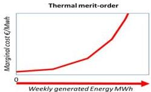
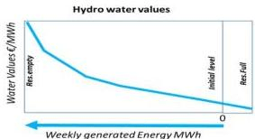
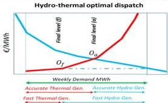

# Water values

Water value corresponds to a fictive cost of using an amount of energy
reflecting the optimal economic strategy.
Antares allows the use of water values and the combination of their use with
pre-existing modelling.
Antares does not calculate by itself water values.

## Introduction

Within the Antares datasets, water values take the form of a table attached
to the generic hydro-reservoir that can be defined for any area of the system.

This table contains, for each day of the year, an array of 101 values
$E_{q=0,100}$ in €/MWh defined for round levels of the reservoir
(0%, 1%, ..., 99%, 100%).

Different questions may be raised about these data:

1. Is the use of water values mandatory in Antares?
2. What is the economic/physical meaning of water values?
3. How can/should water values be assessed?
4. How are water values used in the core of the simulation?
5. How are hydro-costs reported in simulation outputs?

The purpose of this document is to address these issues so as to help Antares
users to make the most of the application.

## Is the use of water values mandatory in Antares?

It is possible to simulate the operation of a fairly complex power system
without any use of water values. The only requirement for that is that
every reservoir of the power system should be managed in the strict
"heuristic target" mode[^1].

Using the heuristic target mode has two practical consequences for the user:

- For all reservoirs with natural inflows, some knowledge must be available
  regarding the usage pattern of the inflows. The user has then to describe
  this pattern in the terms available in the application
  (temporal breaking-down parameters, rule curves, etc.);
  the pattern is used, upstream of the proper optimization,
  to build an "ideal" generation profile (heuristic target).

- For all reservoirs with no natural inflows (closed-loop PSP, batteries, etc.),
  the user has to define the filling level interval within which the
  reservoir[^2] should be initialized at the beginning of each year;
  the storage facility will then be operated so as to get back to this level
  at the end of the week.
  Note that this modelling is not suitable for representing processes in
  which the energy stored during the week is not necessarily used on the
  spot (seasonal PSP, H2).

If the previous conditions are not met, some reservoirs should either be
managed without any heuristic or managed with a heuristic option allowing
the use of water values.
When water values of good quality are available,
the "no-heuristic" mode is expected to provide the most realistic[^3] simulation.

[^1]: 
    Several hydro-management modes are available in the application. They are
    detailed in the Antares general reference guide; an overview is given in
    appendix 1 of the present document.

[^2]:
    An alternative modelling, using no proper reservoir, may be considered for
    these installations: it is based on "binding constraints" between virtual
    generating units. In these models (either daily or weekly), the level
    reached at the end of the week is deemed to be identical to the initial level.
    The important difference is that the initial level is not defined prior to the
    optimization but is a result of the optimization (initial conditions are
    artificially set to an ideal point allowing to get the best economic outcome
    for the week).

[^3]:
    There are a number of irreducible differences between actual operation and
    the simplified modelling required in planning approaches: these differences
    set limits to the "realism" of water values, presented in appendix 2.

## What is the economic and physical meaning of water values?

Since water resources obviously come at no real "fuel" cost,
it may seem strange to give them economic values that look very much alike
thermal costs.
Actually, there is an important difference in nature between the fuel expenses
that may be spent at time $t$ of the simulation and the water values defined
and used at the same point in time.

As a matter of fact, the water value $\nu_{t}^{l}$ defined at a given time $t$
for a given filling level $l$ does not at all represent the actual cost of
generating one hydro MWh at time $t$, which is very small[^4].

What $\nu_{t}^{l}$ represents is the potential economic savings that the future use
of one hydro MWh is expected to bring at some unknown point in a time interval[^5]
[t, planning horizon].
The physical content of water values at $t$ are therefore fuel costs
that could be saved in the future of $t$ if the resource has not been used
before $t$ or, at the latest, at time $t$.
Such early use should of course be preferred if it can bring savings greater
than those "promised" by water values.

Bearing that in mind, the general rationale of the hydro-thermal optimal
dispatch can be construed as follows, for the simulation week encompassing
the time interval $[t_1, t_2]$.
For the sake of simplicity, a power system limited to one single node is
considered, under regular conditions: all of the demand is supplied,
all of the generated energy is used and the reservoir does not overflow.
In this context:

- "Non-hydro" generating units (thermal, nuclear, etc.) should be
  called[^6] by merit-order (i.e. calling first plants with lowest costs)

- All of the "Hydro-storage" energy whose value is greater than the most
expensive "Non-hydro" unit called during the week should be left in the
reservoir at the end of the week (so as to provide future savings greater
than the highest expense incurred in the week)

As a result, the expression of the economic quantity to minimize so as to
reach each individual weekly optimum involves basically two terms (aside from
unit-commitment costs, transmission costs, unsupplied energy costs,
spilled energy costs and overflow costs):

- A "Non-hydro" positive expense made of a sum of fuel costs incurred
  throughout $[t_1, t_2]$

- A "Hydro-storage" negative expense, representing the value of the
  remaining stock at time $t_2$.
  This final (i.e. at the end of the week) stock value is expressed as a
  discretized sum of $Q$ stock slices values, starting from the (most
  valuable) bottom slice and going upward to the final reservoir level.
  The water values $\eta_q$, $q = 1, \ldots, Q$ appearing in that valuation of
  the remaining stock are interpolated from the references set out in the
  table for time $t_2$.

It therefore appears that the hydro-thermal quantity to minimize over
$[t_1, t_2]$ involves a hydro part which is given a negative sign,
the associated savings are probabilistic in nature and are related to a
future period that will be simulated later (unless the week is the very
last of the simulation).
The weekly "hydro-storage" economic contribution has therefore two
characteristics:

- It should not be aggregated to the overall cost actually incurred during
  the simulated week

- Breaking it down between the different hours of the week is a reporting
  mode that may help to interpret the simulation but which has no actual
  physical meaning (virtual accounting process)

[^4]:
    A random epsilon value $\epsilon_t$ depending on $t$ is in practice used 
    in the simulation for the sake of smoothing generation patterns.

[^5]:
    The regular planning horizon in Antares is $t + 1$ year because 
    most hydro-resources are managed on an annual basis. However,
    the suitable modelling of systems involving hyper-annual hydro-reservoirs 
    (e.g. Spain) or other kinds of hyper-annual resources 
    (nuclear cores) should require a longer prospective analysis. 

[^6]:
    Renewable intermittent energies (including hydro run-of-river)
    are modelled as must-run generation that are subtracted from the 
    demand to supply.

## How can/should water values be assessed?

As already stated, water values are probabilistic in nature.
If the power system involves only one single reservoir,
values for each date and level can be rigorously computed by Stochastic
Dynamic Programming (SDP) or by multi-scenarios Deterministic Dynamic
Programming[^7] (DDP).
In broad terms, the computation process involves, in both modes,
three main phases:

1. Assessment of the savings to expect, for each week of each year,
   from discretized amounts of energy generated from the stock.

2. Assessment of the whole stock probabilistic value $V(S,t)$ for the
   different discrete levels and times, going backwards from the end of
   the simulation and taking into account all MC scenarios (demand, inflows,
   etc.)

3. Assessment of the derivative of the stock value
   $\frac{\partial V(S,t)}{\partial S}$ for each discrete level.
   This value is by definition the value of a marginal use of the stock,
   in other words the desired water value.

A dedicated [antares-water-values](https://github.com/AntaresSimulatorTeam/antares-water-values)
python package working on Antares datasets has been developed for that
purpose and is available on Github.

Computing issues appear when the number $\Lambda$ of reservoirs grows,
for both practical and theoretical reasons.
The stock value function
$V(S_1,\ldots ,S_{j,\ldots ,S_{\Lambda},t})$ is now defined over the set
of reservoirs and the derivatives to consider are now partial derivatives
$\frac{\partial V(S_1,\ldots,S_j,\ldots,S_\Lambda,t)}{\partial S_i}$
which cannot simply be tabulated with two-entry tables (assuming that their
assessment is a tractable problem).

There is no perfect way to get around the "curse of dimensionality"
that accompanies the multiplication of reservoirs;
various approaches (among which Stochastic Dual Dynamic Programming -
SDDP) are under consideration in the project's roadmap.

For the time being, the package mentioned previously provides a way to
assess water values for each reservoir, studied one at a time with the
assumption that the $\Lambda$-1 other reservoirs are managed either with the
heuristic option or with water values set in a previous iteration.

[^7]:
    The differences between the approaches lie in how step (2) is carried out. 
    Multi-scenarios DDP aggregates year-long trajectories, 
    while SDP computes expectations at each weekly milestone. 
    Both methods have merits and both are imperfect, partly because 
    of the limits developed in [appendix 1](#appendix-1). 

## How are water values used in the core of the simulation?

When one or more reservoirs are not managed heuristically,
the user can choose between two options related to the way water values
are handled in the optimization.
These options (fast hydro-pricing or accurate hydro pricing) lead to the
formulation of two different objective functions to minimize,
with two different styles of outputs produced.
It should be noted that, in both cases, the cost of the optimal dispatch
is of the form:

$$
\Omega_{dispatch} = \Omega_{real} + \Omega_{hydro}
$$

Where $\Omega_{real}$ contains actual expenses incurred within the week
simulated[^8], while $\Omega_{hydro}$, whose formulation depends on the
chosen option, does not represent actual expenses.

When water values are used, $\Omega_{hydro}$ plays a role in the optimal
schedule assessment and is reported in the output files,
in a way that depends on the chosen type of hydro-pricing.
This paragraph explains how $\Omega_{hydro}$ is formulated in the
optimization problem.
The way $\Omega_{hydro}$ is reported in the output files will be
described later [this section](#how-are-hydro-costs-reported-in-simulation-outputs).

[^8]:
    Thermal fuel costs, transmission fees, lost load indemnities, 
    spilled generation indemnities, hydro overflow indemnities.

### Simulation mode "accurate hydro-pricing"

When the "hydro-pricing" option is set to the value accurate,
the objective function of the mathematical problem solved for each week
$[t_1, t_2]$ is exactly that described previously.

The modelling of each reservoir requires then the use of $Q$
"slice-wise" variables $\Re_{q=1,\dots,Q}$, which are given as many costs
$\eta_{q=1,\dots,Q}$ interpolated from the reference table for time $t_2$.

Besides, for smoothing purposes, the 168 hydro generation variables and
the 168 hydro pumping variables defined at time $t \in [t_1, t_2]$ do not
come completely for free: a very small $\varepsilon_t^*$ is used for
generation while $-\rho \varepsilon_t^*$ is used for pumping ($\rho$ being
the efficiency ratio of pumping).
Neglecting the contribution of these epsilons, we have:

$$
\Omega_{hydro} = - \sum_{q=1,Q} \eta_q \Re_q
$$

Note that the quantity which is optimized, that is to say the value of the
remaining stock, results from the possible conjunction of three phenomena:
outputs from the stock used for generation, inputs to the stock by means of
pumping or inputs to the stock under the form of natural inflows[^9].
Another point of notice is that the answer to the question addressed in the
optimization (what amount of water should best be left in the reservoir at
the end of the week?) does not depend on the assumption made regarding the
economic status of the initial stock, at the beginning of the week (does
this stock come for free or should it be paid for?).
This independence is simply due to the fact that the final reservoir level
is an optimization variable whereas the initial level is a parameter
coming from the optimization of the previous week (on which the
optimization of the current week has no influence, weeks being optimized
sequentially).

[^9]:
    Possibly curtailed by overflows. As a matter of fact,
    168 variables attached to possible reservoir overflow are also defined and 
    used in the objective formulation, in both accurate and fast pricing modes.
    For simplicity’s sake, they are omitted here. The comprehensive formulation 
    is available in the document “optimization problems formulation”.
    Note that overflow costs are not considered as a part of hydro (future)
    costs but as a part of real (current) costs.
    They can be seen as indemnities owed to the hydro producer.
    As of v8.2.0 the same reference indemnity is used for spillage 
    (generated energy that cannot be used) and overflow 
    (energy that cannot be stored in view of future generation)

### Simulation mode "fast hydro-pricing"

When the "hydro-pricing" option is set to the value fast,
the objective function of the mathematical problem solved for each week
is simplified and uses no slice-wise variable.
Instead of assessing the value of the final stock,
the quantity considered is the value of the energy taken from the stock
(by generation) or added to the stock (by pumping).

To express this value in the objective function, the 168 hydro energy
generation variables and the 168 hydro pumping variables defined on the
interval $[t_1, t_2]$ are given constant costs throughout the week.

The cost attached to the generation variables is $\nu$ and the cost
attached to the pumping variables is $-\rho \nu$, where $\nu$ is the
single water value interpolated from the table for the initial stock
level at time $t_1$.

This is acceptable only if the variation of water value throughout the
interval (week initial level, week final level) is very small.
Neglecting again the contribution of epsilons, we have:

$$
\Omega_{hydro} = \sum_{t=1,168} v \left(H_t - \rho \Pi_t\right)
$$

Note that the quantity which is optimized is an expression including only
generating and pumping variables.
Including additional terms $I_t$ representing the natural inflows at
time $t$ would have no effect on the outcome of the simulation since these
quantities are fixed parameters and not variables to optimize.
The possible influence of natural inflows is only implicit, as a
contribution to keeping the reservoir level (and the water value) roughly
constant, thus legitimating the use of the "fast" option.

## Fast pricing mode: easier optimizations but not always acceptable

- If the reservoir size is very large as compared to the three kinds of
  weekly hydro energies involved in the simulation (natural inflow, generated
  energy and pumped energy), then the marginal stock value (water value)
  remains roughly constant throughout the week.
  As a consequence, the hydro resources may locally be seen as a special
  kind of dispatchable generation, whose cost takes place somewhere in the
  overall merit order.
  In such a case, the fast hydro-pricing mode may be used.

- When the reservoir size is of the same order or smaller than either
  weekly natural inflow, generated energy or pumped energy, the intrinsic
  limitation of the fast mode (inability to see the water value rise or fall
  along with the variations of the reservoir level) makes its use
  questionable.
  However, the fact that the reservoir is meant to be fully emptied/filled
  at least once per week (7 times per week in the case of a closed-loop
  daily PSP) mitigates the issue: in this case, water-values have little
  economic meaning and are more a driver freely set up by the user so as to
  emulate an operational behavior to reproduce.

- When the reservoir size is half-way between the two previous cases
  (stock meant to be used in a period of several weeks or more, with weekly
  inputs/outputs representing a sizable portion of the reserve), the fast
  hydro-pricing mode gives poor results and accurate pricing should clearly
  be preferred.

## Accurate pricing mode: always acceptable but more computer-intensive

As compared to the fast mode, accurate pricing involves more variables (one
per reservoir "slice") as well as some additional constraints,
hence leads to a problem more difficult to solve.
It should, however, be preferred whenever computer resources are large
enough to make it tractable.

The difference between the two approaches can be illustrated by a
self-explanatory case shown hereafter.
The optimization problem is the simplest of all: there are no natural
inflows to the reservoir and no pumping capacity is installed;
besides, water values do not depend on time.

The optimal hydro-thermal dispatch is either defined by points $O_{a}$ or
$O_{f}$ on the following pictures, which correspond to different
contributions from the thermal fleet and from the hydro reservoir,
resulting in different final reservoir levels.
$O_{a}$ is the true optimal point while $O_{f}$ is a quick estimate.
If water values were not time-independent, there would be more than one
blue curve.

## How are hydro costs reported in simulation outputs?

It should be remembered that the optimal objective value found by the
solver used in the simulation (either Sirius or a third-part solver) is
the addition of two components:

$$
\Omega_{dispatch} = \Omega_{real} + \Omega_{hydro}
$$

As a result, the raw objective output that may be retrieved from the
solver (for instance, by activating the "export mps" option in the
simulator) mixes together hydro virtual costs and real costs.

In the proper Antares output files, $\Omega_{hydro}$ is reported through
the hourly variables $H.COST$.
These variables are not added up to the overall cost variable $OV.COST$,
whose content is a measure[^10] of $\Omega_{real}$

The next two paragraphs explain how $\Omega_{hydro}$ is reported in both
hydro-pricing options.

[^10]:
    The two quantities are not exactly equal, because of three main phenomena 
    described in the Antares general reference guide: $\Omega_{real}$
    may be influenced by random economic spreads on unsupplied energy cost,
    spilled energy cost and thermal prices, whereas OV.COST includes no spread.
    $\Omega_{real}$ is based on thermal market bids whereas OV.COST 
    reflects thermal reference costs. Finally, $\Omega_{real}$ may include 
    transmission hurdle costs while OV.COST does not.
    The two assessments coincide if there are no spreads, 
    if thermal prices are equal to costs and if there are no transmission fees.

### Simulation mode "fast hydro-pricing"

In this mode, hydro costs are made out of a sum of 168 hourly costs that
may be either positive (generation) or negative (pumping with efficiency
$\rho$).

The process that is carried out by the output builder after completion of
the weekly optimization stands as follows:

1. Retrieve from the solver output all of the optimal values of all
   variables, among which the 168 generation variables $H_t$ and the 168
   pumping variables $\Pi_t$.

2. Compute the 168 reservoir levels $R_t$ resulting from hourly
   generation, pumping, natural inflows $I_t$ and possible overflows $O_t$.

3. Assess, by interpolation from the water value table, the 168 values
   $\nu_t$ related to each time stamp $t$ and level $R_t$.

4. Compute $H.COST(t) = \nu_t(H_t + O_t - I_t - \rho \Pi_t)$.

After time-wise aggregation of hourly values, the output builder then
produces the weekly result:

$$
H.COST(w) = \sum_{t=1,168} v_t (H_t + O_t - I_t - \rho \Pi_t)
$$

Note that there are two differences between the weekly value presented in
the output and the quantity optimized by the solver:

- The output includes the contribution of inflows whereas the objective
  computed by the solver does not.
  As already pointed out, this translation does not make the optimization
  more or less effective.
  Overflows are also internalized so as to account for all components of
  level variations.

- Water values used in the output depend on both time and level,
  whereas the solver uses only the initial water value $\nu$.

Getting back to the illustration presented in 5.3, it can be seen that
the solver computes the area below the **dashed line**, on the right side
of point $O_f$, while the output displays the area below the **blue curve**,
on the right side of point $O_f$, which is equal to the stock value
variation along the week, provided that water values do not depend on time.

If the water values do not depend on time (or vary slowly), the weekly
cost displayed in the output reflects the variation of economic value of
the stock, throughout the week, as the combined outcome of generation,
pumping, natural inflows and possible overflows.

In this mode, hydro costs are made out of a sum of $Q$ contributions to
the final stock value at the end of the week.
Note that in Antares 8.2.0 the value used for $Q$ is 100 but greater values
might be used in the future if more accuracy appears to be both useful and
tractable.

To speed up calculations, at the very beginning of the simulation,
sets of $Q$ round stock values $V_{q=1,Q}^{w}$ for the last days of all
simulated weeks $w$ (same days for all MC years) are computed once for all,
along with $Q$ round stock values $V_{q=1,Q}^{0}$ for the first day of the
first week of the year.

Using the notations:

- $\sum$ Reservoir size in MWh

- $E_{q=0,Q}^{w}$ Reference water values in €/MWh found in the table
  for a reservoir exactly filled at $q\%$ on the last day of the current
  week $w$

- $\eta_{q=1,Q}^{w}$ Mean marginal value of the slice comprised between
  $(q - 1)\%$ and $q\%$

The simple following interpolations are performed:

$$
\eta_{q}^{w} = \frac{E_{q-1}^{w} + E_{q}^{w}}{2}
$$

The preliminary 100 round stock values $V_{q}$ are then assessed by a
simple addition of slice values:

$$
V_{q}^{w} = \frac{\sum}{100} \sum_{i=1,q} \eta_{i}^{w}
$$

A similar process is run for the round values attached to the first day
of the first week of the year, using the water values set for this
specific day.

Note that the first and last days of the year are generally January $1^{\text{st}}$
and December $30^{\text{th}}$ (or July $1^{\text{st}}$ and June $29^{\text{th}}$)
but they may fall at other dates, depending on the simulation calendar and
span (e.g. summer outlook).

The process that is carried out by the output builder after completion of
the weekly optimization of week $w$ stands then as follows:

- for hour $t = 1$, set[^11]:

    $$
    H. COST(w, t) = -H. COST(w - 1, 168)
    $$

- for hours $t = 2,167$, set:

    $$
    H. COST(w, t) = 0
    $$

for hour $t = 168$:

1. Retrieve from the solver all of the optimal values of all variables,
   among which the 168 generation variables $H_{t}$ and the 168 pumping
   variables $H_{t}$.

2. Compute the 168 reservoir levels $R_{t}$ resulting from hourly
   generation, pumping, natural inflows $I_{t}$ and possible overflows $O_{t}$

3. Knowing the final level $R_{168}$ of the last hour of the last day
   of the week, assess the value $V^{*}$ of the residual stock,
   by interpolation from the stock values $V_{q}$ computed in the
   preliminary stage

4. Set:

$$
H. COST(w, 168) = -V^{*}
$$

After regular time-wise aggregation of hourly values, the output builder
then produces weekly results:

$$
H. COST(w) = H. COST(w, 1) + H. COST(w, 168)
$$

The weekly cost displayed in the output reflects the variation of
economic value of the stock, throughout the week, as the combined outcome
of generation, pumping, natural inflows and possible overflows.

The final year-long aggregation yields for year $y$:

$$
H. COST(y) = \sum_{w} H. COST(w) = H. COST(1,1) + H. COST(52,168)
$$

The annual cost displayed in the output reflects the variation of
economic value of the stock, throughout the year, as a global result of
generation, pumping, natural inflows and possible overflows.

Note that, for each week of the year:

- The hourly value $H.COST(w, 168)$ presented in the output for hour 168
  is the same as that computed by the solver for the week (residual stock
  value).
  On the illustration presented in 5.3, this quantity is equal to the
  area below the blue curve, on the left side of point $O_{a}$.

- The weekly value $H.COST(w)$ presented in the output for the week is
  equal, on the illustration presented in 5.3, to the area below the
  blue curve, on the right side of point $O_{a}$.

[^11]:
    In this implementation, the economic assumption made regarding the initial 
    stock is that it does not come for free and has to be bought. 
    [As already pointed out](#simulation-mode-accurate-hydro-pricing), 
    this choice has no influence on the outcome of the simulation. 
    The investment required at the beginning of week $w$ is then exactly 
    the value left in the reservoir at the end of week $w-1$. 
    If week $w$ is the first week of the year, a calculation identical 
    in principle to that defined for hour 168 is performed with relevant parameters. 

### Comparison between fast and accurate hydro-pricing

Both approaches aim at finding optimal values for generation and pumping
decisions throughout the week, this leading to an optimal final reservoir
level.

The accurate modelling yields an all-optimal set of results but is more
computer-intensive than the fast modelling.
The fast modelling yields a sub-optimal final reservoir level,
hence sub-optimal generating and pumping variables.

The accurate output gives an exact assessment of the stock value variation
between the beginning and the end of the week, whereas the fast output
gives an approximation of this quantity, broken down between the 168
hours of the week.

The two assessments are similar only if:

- Water values depend on filling level but do not depend on time.

- The water value attached to the final reservoir level is identical to
  that of the initial level ($O_{a} = O_{f}$ on the illustration given in
  5.3)

Note that, if deemed useful, both reporting modes could in the future be
made available in the output, regardless of the optimization mode.
This would require to extend the output format to accommodate one additional
variable, introducing a difference between the existing $H.COST$ variable
and a new $H.DIFF$ variable, one being used for the incremental "fast" report
and the other for the global "accurate" report.
Note also that package can be used to provide yet other reports
(e.g. hourly full stock value).

## Appendix 1

### Overview of the hydro management modes available in Antares Simulator

The management of any reservoir is defined by seven principal binary
primary options (e.g. use / do not use heuristic target), each one being
associated with a number of secondary tunable parameters
(e.g. "inter-monthly breakdown").

Out of the $2^{7} = 128$ theoretically possible combinations, only 18 are
actually meaningful.
The seven options and their meaning are briefly presented hereafter,
along with the table of the 18 modes available in the application.
Note that modes 1 to 6 do not require the definition of water values;
modes 7 to 10 cannot be used when there are no natural inflows to the
reservoir.
More details can be found in the general reference guide.

**Reservoir management**: indicates whether data related to the reservoir
are available or not. In the latter case, "inflow" statistics will be
construed as direct generation statistics

**Use heuristic target**: indicates whether a natural inflow typical usage
pattern is available and should be reproduced or not

**Follow load modulations**: indicates whether generation modulations
should rather be parallel to the demand or to the inflows

**Use water value**: indicates whether water values are available and
should be used or not

**Use leeway**: indicates whether the generation pattern should or not be
allowed to deviate from the generation heuristic target, if any

**Hard bounds on rule curves**: indicates whether every effort should or
not be made to accommodate lower and upper rule curves in the course of
the optimization (regardless of this option, lower and upper rule curves
are used to determine the heuristic target, if any)

**Power-to-level modulations**: indicates whether the maximum generating
and pumping power depend on the reservoir filling level (note that the
modulation coefficient is assumed to be kept constant during the week,
equal to that found for the initial reservoir level).

|                            | 1              | 2              | 3              | 4              | 5              | 6              | 7              | 8              | 9              | 10             | 11             | 12             | 13             | 14             | 15             | 16             | 17             | 18             |
| -------------------------- | :------------: | :------------: | :------------: | :------------: | :------------: | :------------: | :------------: | :------------: | :------------: | :------------: | :------------: | :------------: | :------------: | :------------: | :------------: | :------------: | :------------: | :------------: |
| Reservoir management       | :red_square:   | :red_square:   | :green_square: | :green_square: | :green_square: | :green_square: | :green_square: | :green_square: | :green_square: | :green_square: | :green_square: | :green_square: | :green_square: | :green_square: | :green_square: | :green_square: | :green_square: | :green_square: |
| Use heuristic target       | :green_square: | :green_square: | :green_square: | :green_square: | :green_square: | :green_square: | :green_square: | :green_square: | :green_square: | :green_square: | :red_square:   | :red_square:   | :red_square:   | :red_square:   | :red_square:   | :red_square:   | :red_square:   | :red_square:   |
| Follow load modulations    | :red_square:   | :green_square: | :red_square:   | :green_square: | :red_square:   | :green_square: | :red_square:   | :green_square: | :green_square: | :green_square: | :green_square: | :green_square: | :green_square: | :green_square: | :green_square: | :green_square: | :green_square: | :green_square: |
| Use water value            | :red_square:   | :red_square:   | :red_square:   | :red_square:   | :red_square:   | :red_square:   | :green_square: | :green_square: | :green_square: | :green_square: | :green_square: | :green_square: | :green_square: | :green_square: | :green_square: | :green_square: | :green_square: | :green_square: |
| Use Leeway                 | :red_square:   | :red_square:   | :red_square:   | :red_square:   | :red_square:   | :red_square:   | :green_square: | :green_square: | :green_square: | :green_square: | :red_square:   | :red_square:   | :red_square:   | :red_square:   | :red_square:   | :red_square:   | :red_square:   | :red_square:   |
| Hard bounds on rule curves | :red_square:   | :red_square:   | :red_square:   | :red_square:   | :green_square: | :green_square: | :red_square:   | :red_square:   | :green_square: | :green_square: | :red_square:   | :red_square:   | :green_square: | :green_square: | :red_square:   | :red_square:   | :green_square: | :green_square: |
| Power-to-level modulations | :red_square:   | :red_square:   | :red_square:   | :red_square:   | :red_square:   | :red_square:   | :red_square:   | :red_square:   | :red_square:   | :red_square:   | :red_square:   | :red_square:   | :red_square:   | :red_square:   | :green_square: | :green_square: | :green_square: | :green_square: |

## Appendix 2

### Use of water values in power system simulation: Differences between
short-term operation and long-term planning

Water values used in a long-term planning simulator such as Antares are
expected to provide a realistic view of the behavior of the operator at some
point in the future.
An ideal implementation would therefore demand that the Antares Simulator
use water values similar to those that would be determined by the operator
when facing the same conditions, i.e. the same times-series of climatic
variables and data related to the system state.
In this context, getting the same water values would require that the
Antares Simulator include a copy of the short-term tools actually used in
operational planning.

Such tools actually compute and reassess periodically water values for
hydro-reservoirs; they are highly complex and computer-intensive.

Emulating the behavior of operational tools within Antares would therefore
require that the water values to use for a given week of a given
Monte-Carlo year be computed "on the spot", the water value table being
constantly refreshed after completion of each week of simulation.
In such an operational approach, new scenarios for the future would be
redefined each week, starting with largely deterministic conditions that
progressively transform to a cone of uncertainty, this cone getting larger
and larger when the horizon recedes.

It is obviously out of the question to try to implement such a process in
an Antares simulation, which commonly encompasses several hundred Monte Carlo
years, which means several thousands of weeks of operation.
Antares' long-term Monte-Carlo scenarios are necessarily defined once for
all and are as widely dispersed at their starting point as they are at
their end.
Accordingly, water values are assumed to be assessed once for the whole
bundle of scenarios and for the whole year.

Not being able to reassess periodically the water values has necessarily
some drawbacks, among which the following:

- Occurrence of extreme and durable weather conditions (cold spells,
  draughts, etc.): In actual operation, such short-term weather conditions
  are partly predictable and would strongly influence the definition of
  the likely scenarios to consider for the next weeks.
  In Antares, water values computed once for all are blind to this
  information and, for instance, are committed to make the unrealistic
  assumption that the probabilities for the next week to be extremely
  cold or warm do not depend at all of the temperature registered for the
  current week.

- Some medium-term phenomena may see a strong reduction of stochasticity
  as time progresses.
  For instance, a large part of late spring inflows is predictable once
  the amount of winter snow is known.
  Operational tools necessarily incorporate this knowledge, while Antares
  "waits" for the future inflows to be revealed, without any possibility
  to take into account an information that may have been available for
  several weeks.
  This is again due to the fact that water values had to be computed
  once for all ahead of the simulation and not in real time.

Aside from this kind of bias, long-term water values that can be construed
through a process such as that developed for Antares in the dedicated
package are subject to another type of limitation, coming from the
multiplicity of reservoirs whose operation may have to be coordinated
throughout the system.

This point, already mentioned in the body of the document, is related to
the fact that two-entry water value tables used in Antares cannot reflect
all the complexity of the multi-dimensional stock value.
On the operational side, the fact that the initial state of all reservoirs
is perfectly known helps to define more robust short-term indicators.

All the limits pointed out here explain how operational and planning
approaches have to differ, operation being inevitably more realistic since
better informed.
It can also be noted that this general statement has a lesser strength
when the "inflows" considered (underground gas injection, nuclear fuel
reloading, etc.) are not subject to a stochasticity as high as that of
actual hydro-resources.
