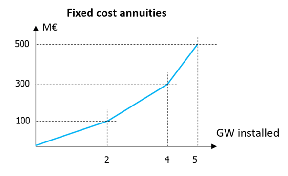

# Xpansion candidates

## Parameters

#### Name

<span class="param-badge badge-string">string</span>
Specifies the name of the investment candidates. Antares Xpansion uses this
name in the output and the logs.

!!! warning
    This field must not contain spaces!

#### Link

<span class="param-badge badge-string">string</span>
Defines the link of the Antares study candidate for investment, whose
capacities (direct and indirect) will be modified by Antares Xpansion. The
syntax of the link name includes the names of the two Antares nodes that are
connected by the link, separated by "-", for example:
```
origin_area - destination_area
```
Node names that include spaces or dashes are not compatible with
Antares Xpansion. The origin area corresponds to the first in the spelling
order. The same link may contain several investment candidates (see
[this section](#several-investment-candidates-on-the-same-link)).

#### Annual cost per mw (€/MW/year)

<span class="param-badge badge-float">float</span>
The decimal separator is the point. It defines the fixed cost annuity of the
investment candidate. Depending on the type of candidate, the fixed cost annuity
can include:

- Fixed operation and maintenance costs,
- An investment cost annuity.

#### Max investment (MW)

<span class="param-badge badge-float">float</span>
Represents the candidate's potential, i.e. the maximum capacity that can be
invested in this candidate. If this parameter is set, the invested capacity
can take any value in the interval \[0, max-investment\].

#### Unit size (MW)

<span class="param-badge badge-float">float</span>
Defines the nominal capacity of the investment candidate's units.

#### Max units

<span class="param-badge badge-int">int</span>
Corresponds to the candidate's potential in terms of number of installable
units. If the parameters max-units and unit-size are set, then the invested
capacity is necessarily a multiple of unit-size from the set:

$$
{0, \texttt{unit-size}, 2 \cdot \texttt{unit-size}, \ldots , \texttt{max-units} \cdot \texttt{unit-size}}
$$

!!! warning
    The definition of an investment candidate must necessarily include either
    (i) a maximum potential in MW (max-investment) or (ii) a unit size in MW
    (unit-size) and a maximum potential in number of units (max-units).

#### Already installed capacity (MW)

<span class="param-badge badge-float">float</span>
Corresponds to a capacity that is already installed on the investment
candidate's link. If Antares Xpansion finds that the investment in this candidate
is economically relevant, the new capacity will be added to the already installed
capacity. The transmission capacities initially indicated in the Antares
study are not considered in the already-installed-capacity parameter and
are overwritten by Antares Xpansion.

#### (In)direct link profile

<span class="param-badge badge-string">string</span>
Specifies the name of a file. It must contain at least one column of 8760
numerical values. Multiple columns are used in order to use different data
depending on the Monte-Carlo year in process, see details
[here](#using-different-profiles-depending-on-the-monte-carlo-year). When only
one column is specified, the same profile is used by Antares Xpansion for all
Monte-Carlo years of the Antares study and all assessed capacities.

!!! note
    Both files direct-link-profile and indirect-link-profile must contain the
    same number of columns.

The (in)direct-link-profile makes the link between the invested capacity and
the capacity that is actually available, in the (in)direct directions of the
Antares link, for the 8760 hours of the year. More details are given in
[this section](#link-between-invested-capacity-and-capacity-of-the-antares-study).

The (in)direct-link-profile can be used for example to represent the
maintenance of a generation asset via a seasonalized power outage, or the
average load factor of intermittent renewable generation, defined at hourly
intervals.

File `user/expansion/candidates.ini`:
```ini
[1]
name = pv
link = area1 - pv
annual-cost-per-mw = 46000
max-investment = 1000
already-installed-capacity = 50
direct-link-profile = capa_pv.csv
indirect-direct-link-profile = capa_pv.csv
already-installed-direct-link-profile = direct_installed_capa_pv.csv
already-installed-indirect-link-profile = indirect_installed_capa_pv.csv
```

!!! note
    You can import a the link profiles in the **Xpansion** > **Capacities** tab of
    Antares Web. Containing load factor profile in the Antares Xpansion format.
    Each 8760 value column represent the profile for a complete year and can be
    affected to a Monte-Carlo year with the scenario builder. If you don't care
    about scenario you can define only one column.

#### Already installed (in)direct link profile

<span class="param-badge badge-string">string</span>
Specifies the name of a file. This file must be located in the
`user/expansion/capa/` directory of the Antares study and has the same format
as a (in)direct-link-profile file. The already-installed-(in)direct-link-profile
makes the link between the already installed capacity and the available
capacity, in the direct and indirect way of the Antares link, for the 8760
hours of the year. More details are given in
[this section](#link-between-invested-capacity-and-capacity-of-the-antares-study).

!!! Note
    The same file can be used for (in)direct-link-profile and
    already-installed-(in)direct-link-profile of one or more candidates.

## Link between invested capacity and capacity of the Antares study

!!! Note
    For simplicity, we often refer to [already-installed]-direct-link-profile and
    [already-installed]-indirect-link-profile link profiles as just
    [already-installed]-link-profile in the sequel.

The parameters link-profile, already-installed-capacity and
already-installed-link-profile are used to define the link between the
capacity installed by Antares Xpansion, the already installed capacity and
the truly available capacity in the Antares study, hour by hour and in both
directions of the link, following the relationship presented in **Figure 6**.

$$
\underbrace{\text{available capacity}}_{\substack{\text{Capacity time series} \\
\text{seen by Antares}}} =
\underbrace{x_0}_{\substack{\text{already-installed} \ \text{capacity}}} \cdot
\underbrace{
\begin{bmatrix}
0.65 & 0.9 \\
0.65 & 0.9 \\
\vdots & \vdots
\end{bmatrix}   
}_{\substack{\text{already-installed} \ \text{link profile}}}
+
\underbrace{x}_{\substack{\text{Target additional} \ \text{investment} \ \text{(optimized by} \ \text{Xpansion)}}}
\cdot
\underbrace{
\begin{bmatrix}
0.95 & 0.8 \\
0.95 & 0.8 \\
\vdots & \vdots
\end{bmatrix}
}_{\text{link-profile}}
$$

By default, the link-profile and already-installed-link-profile contain only
1's, thus assuming perfect availability of the invested capacity.

The parameters link-profile and already-installed-link-profile are
conventionally used to:

- Take into account an NTC profile on an interconnection, possibly seasonalized
  and having a different impact on the direct and indirect directions of the
  link. It is possible to specify a different NTC profile for each
  Monte-Carlo year.

- Represent the maintenance of a thermal generation asset by considering a
  reduction of its power, possibly different according to the season (see
  **Figure 7**),

- Model renewable generation by multiplying the invested capacities by a
  load factor chronicle (e.g. an average chronicle or the chronicles of some
  Monte-Carlo years).

If you use the average availability, to validate the results after running
the Antares Xpansion, it is preferable to re-simulate these outages according to
a stochastic process by relaunching an Antares simulation with the
capacities obtained by Antares Xpansion in order to obtain the real production
program with outages and RES intermittence varying according to the scenarios.

## Using different profiles depending on the Monte-Carlo year

From Antares-Simulator 8.2, users can define different NTC chronicles for
different Monte-Carlo years. Briefly, users define any number of chronicles
for each link. For each link, users can select (randomly or not) one of the
said chronicles in a result we call _scenario_. Refer to [Antares Simulator
documentation](https://antares-simulator.readthedocs.io/en/latest/reference-guide/04-active_windows/#links)
for more information.

In Antares Xpansion, it is possible to use those scenarios to select a
different link profile depending on the Monte-Carlo year. There are a few
pre-requisites:

1. For a given candidate, if specified, direct-link-profile, indirect-link-profile,
   already-installed-direct-link-profile and
   already-installed-indirect-link-profile must have the same number of
   columns.
2. For a given link in the Antares-Simulator study, the number of columns for
   NTC chronicles must be the same as in the link profiles and already installed
   profiles for the candidates on this link.
3. It is possible not to provide a link profile or already installed profile. A
   profile with a value of 1 is used whichever Monte-Carlo year is chosen.

## Examples of candidates

### Basic example

An example with two investments candidates, one in semi-base generation and
one in network capacity, is given below.


The invested semi-base generation in `area1` is shifted in the virtual node
`invest_semibase`. During the optimization process, the capacity of the
link between `area1` and `invest_semibase` will be updated with the new
invested capacity.

The `candidates.ini` file for this example is the following one:

```ini
[1]
name = semibase
link = area1 - invest_semibase
annual-cost-per-mw = 126000
unit-size = 200
max-units = 5
already_installed_capacity = 200

[2]
name = grid
link = area1 - area2
annual-cost-per-mw = 3000
unit-size = 500
max-units = 4
```

Another example with solar generation in a virtual node:

```ini
[1]
name = solar_power
link = area1 - pv1
annual-cost-per-mw = 100000
max-investment = 10000
direct-link-profile = pv1.txt
indirect-link-profile = pv1.txt
```
where `pv1.txt` is a text file, located in the `user/expansion/capa/` folder
of the study, and which contains the load factor time series of the
candidate. When \x\ MW of the candidate `solar_power` are invested, the
actual time series of available power is equal to the product of \x\ and
the time series `pv1.txt`.

### Several investment candidates on the same link

The same link in an Antares study can be the support of several investment
candidates. The interest of such an approach can be:

- To define several potentials with different fixed cost annuities,
- To define several investment opportunities of different unit size.

!!! example
    For example, for an investment in photo in photovoltaic production with
    three potentials of increasing cost.

    ```
    [1]
    name = pv_fr_1
    link = fr - pv_fr
    annual-cost-per-mw = 50000
    max-investment = 2000
    link-profile = profil_pv.txt

    [2]
    name = pv_fr_2
    link = fr - pv_fr
    annual-cost-per-mw = 100000
    max-investment = 2000
    link-profile = profil_pv.txt

    [3]
    name = pv_fr_3
    link = fr - pv_fr
    annual-cost-per-mw = 200000
    max-investment = 1000
    link-profile = profil_pv.txt
    ```

    This is equivalent to:

    

This only works with the Antares Xpansion algorithm (Benders decomposition)
if the costs are increasing and if the investment candidates with the same
link have the same already-installed-capacity and
already-installed-link-profile.

### Decommissioning candidates

In this example, we show how to consider both an investment candidate and a
decommissioning candidate on the same link. Candidates for decommissioning
must be moved from their physical location to a virtual node as explained in
[Prepare the Antares study](xpansion-prepare-study.md#decommissioning-decisions-for-thermal-capacities).

We strongly advise to explicitly specify candidates for decommissioning in the
name field of the candidates.ini file (although this is not required by the
tool). This will ease the analysis of Antares Xpansion output for the user.

By considering
[several investment candidates on the same link](#several-investment-candidates-on-the-same-link),
it is possible to model both an investment and a decommissioning candidate.

- The candidate for decommissioning is defined by:

    - A decommissionable capacity, that corresponds to a max-investment or
      max-units $\times$ unit-size.
    - Fixed operation and maintenance costs (no investment cost) given in
      the field annual-cost-per-mw.

- The candidate for investment is defined as by:

    - An expandable capacity, that corresponds to a max-investment or
      max-units $\times$ unit-size.
    - A fixed-cost annuity that includes investment costs and fixed operation
      and maintenance costs given in the field annual-cost-per-mw.
      
```
[1]
name = fr_ccg_decommissioning
link = fr - fr_ccg              # Link between the node France and the thermal cluster CCG 
annual-cost-per-mw = 36000      # Fixed annual operation and maintenance costs
unit-size = 330
max-units = 19                  # Thermal cluster CCG currently installed

[2]
name = fr_ccg_investment
link = fr - fr_ccg
annual-cost-per-mw = 126000     # Fixed annual operation and maintenance costs + annualized investment costs
unit-size = 330
max-units = 50                  # New potential of buildable CCG
```

!!! warning
    The hourly availability time series of thermal generation CCG in Antares
    should be higher than the sum of currently installed and new potential
    buildable capacities (availability of CCG cluster in the virtual node
    $\mathrm{fr}_{ccg} > 330 \cdot 19 + 330 \cdot 50$ in this example).

!!! note
    If the user specifies an already-installed-capacity for the
    decommissioning candidate, this capacity will **not** be decommissioned by
    Antares Xpansion.

From the modelling of _decommissioning candidates_, it follows that the
final result should be read "in the opposite way" compared to _investment
candidates_:

  - If the result displayed in the console for fr_ccg_decommissioning is
    300 x 19 MW invested, this means that **no unit is decommissioned**.
  - If the result displayed in the console for fr_ccg_decommissioning is
    0 MW invested, this means that **all units have been decommissioned**.
