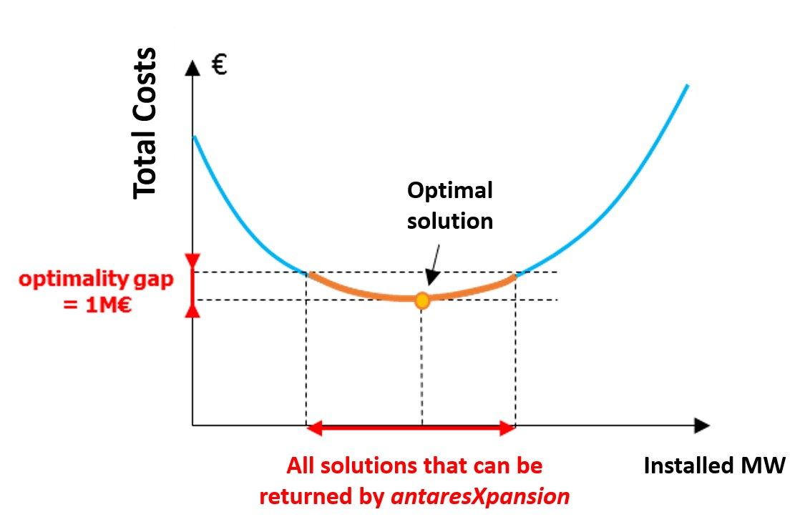

# Xpansion settings

## Optimization

#### UC type

<span class="param-badge badge-enum">enum</span>
The unit-commitment type parameter specifies the simulation mode used by
Antares to evaluate the operating costs of the electrical system:

- `expansion_fast`: Deactivate the flexibility constraints of the thermal units
    (Pmin constraints and minimum up and down times), and don't take into account
    either the start-up costs or the impact of the day-ahead reserve.

- `expansion_accurate`: The unit-commitment variables are relaxed.
    The flexibility constraints of the thermal units as well as the start-up
    costs are taken into account.

#### Master problem

<span class="param-badge badge-int">int</span>
The master parameter provides information on how integer variables are taken
into account in the Antares Xpansion master problem.

- `relaxed`: The integer variables are relaxed, and the level constraints of the
    investment candidates (cf. unit-size) will not be necessarily respected. The
    master problem is linear.

- `integer`: The investment problem is solved by taking into account unit-size
    constraints of the candidates. The master problem is a MILP (Mixed-Integer
    Linear Program).

For problems with several investment candidates with large max-units, using
master = relaxed can accelerate the Antares-Xpansion algorithm very
significantly.

#### Max iteration count

<span class="param-badge badge-int">int</span>
Maximum number of iterations for the Benders decomposition algorithm. Once
this number of iterations is reached, the Antares Xpansion algorithm ends,
regardless of the quality of the solution.

#### Absolute optimality gap (€)

<span class="param-badge badge-float">float</span>
The optimality gap defined in euros, is the tolerance for the Antares
Xpansion algorithm.

At each iteration, the algorithm computes upper and lower bounds on the optimal
cost. The algorithm stops as soon as the quantity `best_upper_bound -
best_lower_bound` falls below `optimality_gap`. The solution returned by the
algorithm has a cost equal to `best_upper_bound`, which is guaranteed to be
within `optimality_gap` euros of the optimal cost.

* If `optimality_gap = 0`, Antares-Xpansion will continue its search until the
    optimal solution of the investment problem is found.
* If `optimality_gap > 0`, the search will stop as soon as
    `best_upper_bound - best_lower_bound < optimality_gap`.

Here is an illustration of the optimality gap and the set of solutions that
can be returned by the package when the gap is strictly positive.



The interest of a strictly positive `optimality_gap` is that it speeds up the
search by stopping as soon as a "good" solution is found.

The interpretation of this stopping criterion is not always obvious. It
certainly guarantees that a solution found by the algorithm has a cost that is
close to the optimum, but it does not provide any information on the distance
(in MW) between the installed capacities of this solution and those of the
optimal solution: if the cost function is relatively flat around the optimum,
solutions whose costs are close may have significantly different installed
capacities.

**Which settings should I use for the** `optimality_gap`?

1. I have to run several expansion optimizations of different variants of a
   study and compare them. In that case, if the optimal solutions are not
   returned by the package, the comparison of several variants can be tricky.
   The inaccuracy of the method might indeed be of the same order of magnitude
   as the changes brought by the input variations. It is therefore advised to be
   as closed as possible from the optimum of the expansion problem. To do so,
   we advise to set the `optimality_gap` to zero.

2. I am building one consistent generation/transmission scenario. As the optimal
   solution is not more realistic than an approximate solution of the modelled
   expansion problem, the settings can be less constraining with an
   `optimality_gap` of a few million euros.

#### Relative optimality gap

<span class="param-badge badge-float">float</span>
Tolerance on the relative gap for the Antares Xpansion algorithm.

At each iteration, the algorithm computes upper and lower bounds on the optimal
cost. The algorithm stops as soon as the quantity
`(best_upper_bound - best_lower_bound) / max(|best_upper_bound|, |best_lower_bound|)`
falls below `relative_gap`. For a relative gap $\alpha$, the cost of the
solution returned by the algorithm satisfies:

$$\frac{{\scriptstyle\texttt{xpansion solution cost}} - {\scriptstyle\texttt{optimal cost}}}{{\scriptstyle\texttt{optimal cost}}} < \alpha .$$

!!! note
    The algorithm stops as soon as the first criterion among `optimality_gap`
    and `relative_gap` is met. Keep in mind that if either parameter is not
    specified by the user, the default value is used.

#### Relaxed optimality gap

<span class="param-badge badge-float">float</span>
The `relaxed_optimality_gap` parameter only has effect when `master = integer`.
In this case, the master problem is relaxed in the first iterations.
The `relaxed_optimality_gap` is the threshold from which to switch back from
the relaxed to the integer master formulation.

In the first iterations, the algorithm computes upper and lower bounds on the
optimal cost of the relaxed master problem. The algorithm switches to the
integer formulation as soon as the quantity
`(best_upper_bound - best_lower_bound) / best_upper_bound` falls below
`relaxed_optimality_gap`. For the subsequent iterations, the best upper bound
is reset to $+\infty$ as the solutions of the relaxed problem are not feasible
for the integer formulation.

#### Solver

<span class="param-badge badge-enum">enum</span>
Solver that is used to solve the master and the subproblems in the
[benders decomposition](xpansion-theory.md#benders-reformulation-and-decomposition-algorithm).
The user can set `Cbc` which stands for the COIN-OR optimization suite.
Depending on whether the problem has integer variables, Antares Xpansion
calls either the linear solver ([Clp](https://github.com/coin-or/Clp)) or
the MILP solver ([Cbc](https://github.com/coin-or/Cbc)) of the COIN-OR
optimization suite.

!!! note
    In Antares Xpansion, the subproblems are always linear. If `master = relaxed`,
    the master problem is linear as well, whereas if `master = integer`, the
    master problem is a MILP.

#### Separation parameter

<span class="param-badge badge-float">float</span>
Defines the step size for the in-out separation in $[0,1]$. If $x_{in}$ is the
current best feasible solution and $x_{out}$ is the master solution at the
current iteration, the investment in the subproblems is set to

$$
x_{cut} = {\small \texttt{separation parameter}} * x_{out} + (1 - {\small \texttt{separation parameter}}) * x_{in} .$$

The in-out stabilisation technique is used in order to speed up the Benders
decomposition. When `separation_parameter < 1`, it is necessary to relax the
master problem in the first iterations as the cut point $x_{cut}$ is a
convex combination of the best feasible solution and of the solution of
the master problem. In the case where `master = integer`, the algorithm
proceeds as follows:

1. Solve the first iterations with the relaxed formulation using the in-out
   stabilisation technique
2. Once the gap is *sufficiently small* (see
   [`relaxed_optimality_gap`](#relaxed-optimality-gap)), switch back to the
   integer formulation and set back `separation_parameter = 1` i.e. use the
   classical Benders algorithm.

#### Time limit (h)

<span class="param-badge badge-int">int</span>
Maximum allowed time in seconds for the execution of the Benders step of
Antares Xpansion (i.e. the time of the initial Antares simulation and for
the problem generation step is not accounted for). Once the timelimit is
reached, the algorithm finishes the current Benders iteration - which can
take several additional seconds or minutes - and terminates.

#### Batch size

<span class="param-badge badge-int">int</span>
This parameter specifies the number of subproblems per batch. If set to `0`,
then all subproblems are in the same batch. In this case, the classical
Benders is launched.

#### Log level

<span class="param-badge badge-enum">enum</span>
Possible values: `{0, 1, 2}`, specifying the `solver`'s log severity. Default
value: `0`.

Logs can be printed both in the console and in a file. There are 3 types of
logs:

- **Operational**: Displays progress information for the investment on
  candidates and costs,
- **Benders**: Displays information on the progress of the Benders algorithm,
- **Solver**: Logs of the solver called for the resolution of each master or
  subproblem.

The table below details the behavior depending on the `log_level`.

|             | **Operational**              | **Benders**                   | **Solver**                           |
|-------------|------------------------------|-------------------------------|--------------------------------------|
| **File**    | Always `(reportbenders.txt)` | Always `(benders_solver.log)` | 2 `(solver_log_proc_<proc_num>.txt)` |
| **Console** | 0                            |  >= 1                         | Never                                |

#### Cut coefficient tolerance

<span class="param-badge badge-float">float</span>
Tolerance under which cuts coefficients and right-hand sides are considered
to be zero. This allows to have "clean" cuts in the master problem, in order
to avoid numerical issues. This should be less than 1.

#### Master solution tolerance

<span class="param-badge badge-float">float</span>
Control the tolerance used when rounding the solution variables of the
master problem. It allows to restore feasibilities of master solutions (as
the solver may return slightly infeasible values). Also in the stabilized
version (i.e. when `separation_parameter < 1`), if `x_cut` is within this
tolerance of a bound, it will be rounded to this bound before fixing the
subproblems candidates values. This helps to avoid numerical artifacts.

## Modeling add-ons

#### Yearly weight

<span class="param-badge badge-string">string</span>
The parameter `yearly-weights` allows to assume that the Monte Carlo years
simulated in the Antares study are not equally probable. The most
representative years may be given greater weight than those that are less
representative. The `yearly-weights` parameter defines a file that stores a
vector $\left( \omega_{1},\ldots,\omega_{n} \right)$, with $n$ the number
of Monte-Carlo years in the study, which is used to evaluate the expected
production cost:

$$ \mathbb{E}\left(\text{cost}\right) = \frac{\sum_{i = 1}^{n}{\omega_i\text{cost}_i}}{\sum_{i = 1}^{n}\omega_{i}} \ , $$

with $\text{cost}_{i}$ the production cost of the $i$-th Monte Carlo jaar
and $\omega_i$ the associated weigth.

The input file must contain a single column with as many numerical values as there are
Monte-Carlo years in the Antares study. The value of the $i$-th row is the weight $\omega_i$ of the
$i$-th Monte Carlo year.

!!! note
    You can import the weights file in the **Xpansion** > **Weights** tab.

If the `yearly-weights` parameter is not used, the Monte-Carlo years of the
Antares study are considered to be equally-weighted.

!!! note
    The `yearly-weights` parameter **must be set in line with the Antares
    study playlist by the user**: years with zero weights must be removed from
    the Antares study playlist in order not to be simulated unnecessarily.

#### Additional constraints

<span class="param-badge badge-string">string</span>
Name of the additional constraint file. It allows to impose linear constraints
between the invested capacities of investment candidates. These linear
constraints will be added to the master problem.

!!! note
    You can import it in the **Xpansion** > **Constraints** tab.

The format of the file is inspired from binding constraints.

```ini
[1]                     # index
name = additional_c2    # Constraint name, unique and without any special symbols or space
semibase = 3            # Numeric coefficient of the variables
peak = 2                # Numeric coefficient of the variables
sign = less_or_equal    # Sign is less_or_equal, equal, or greater_or_equal
rhs = 300               # rhs is numeric and is the second term of the constraint
```

Here, the corresponding constraint equation is: $3 \times \texttt{semibase} + 2 \times \texttt{peak} \leq 300$.

A constraint in the `additional-constraints` is defined with the following
parameters:

- `name`: string. The constraint name must be unique and must not contain any
  special symbols or space.

- `<investment-candidate-name>`: float. Coefficient of the left-hand side
  variable corresponding to `<investment-candidate-name>`.

- `sign`: Either `less_or_equal`, `equal` or `greater_or_equal`. Defines
  the relationship between the left-hand side and right-hand side of the
  constraint.

- `rhs`: float. Right-hand side of the constraint.

The user can also optionally use binary constraints to represent, for example,
exclusion constraints. The `[variable]` section is optional and allows the
definition of optional variables linked to investment candidates for
exclusion constraints.

!!! warning
    The use of binary variables is not recommended as it greatly increases the
    calculation time.

Antares Xpansion cannot invest in `semibase` and `peak` at the same time, but
it can invest in neither:

```ini title="additional-constraint.ini"
[variables]
semibase = bin_semibase
peak = bin_peak        
pv = bin_pv            

[1]
name = additional_c1
bin_semibase = 1        
bin_peak = 1            
sign = less_or_equal
rhs = 1

[2]
name = additional_c2
semibase = 3
peak = 2
sign = less_or_equal
rhs = 300
```

The above constraints translate to:

1. $1 \times \texttt{bin_semibase} + 1 \times \texttt{bin_peak} \leq 1$
2. $3 \times \texttt{semibase} + \texttt{peak} \leq 300$

## Sensitivity calculation

#### Max gap to optimum (€)

<span class="param-badge badge-float">float</span>
Defines the maximum gap with the optimal solution that is allowed.

#### Compute CAPEX

<span class="param-badge badge-bool">bool</span>
Whether to solve CAPEX sensitivity problems (minimization and maximization).

#### Projections

<span class="param-badge badge-string">string</span>
List of candidate names for which the projection of the set of $\varepsilon$-optimal
solutions is computed. For each candidate, two problems are solved: minimization and maximization of the invested capacity.
