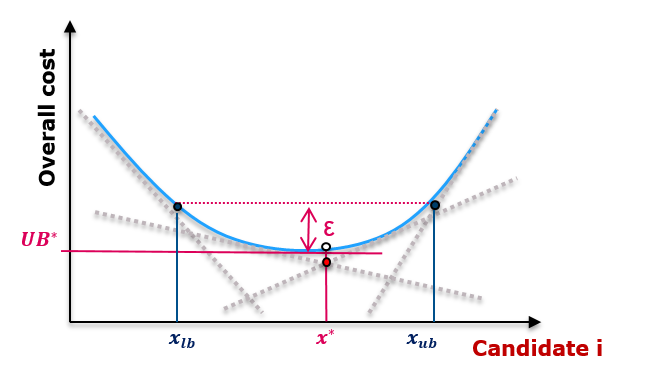

# Investment problem

Here is the mathematical formulation of the investment problem considered in
Antares Xpansion. We also explain the Benders decomposition algorithm that is
used.

## Problem formulation

We consider a power system with given production and transmission capacities.
Antares Xpansion seeks to invest in additional capacities in order to minimize
the sum of annualized investment costs and yearly operating costs.

### Variables and costs

#### Invested capacity and investment cost

Let $(x_i)_{1 \leq i \leq n}$ be the variables modeling the invested capacities
(in MW) of the candidates.

- If the investment is continuous,
  $x_{i} \in [0, \overline{x}_{i}]$,
  where $\overline{x}_{i}$ is the upper bound on the investment for candidate
  $i$ i.e. $\overline{x}_{i}$ is the `max-investment`.

  We denote by $\mathcal{R}$ (for real) the set of indices of candidates with
  continuous investment.

- If the investment is integer,
  $x_{i} \in \{0, u_{i}, \ldots, \overline{x}_{i} = K_{i}u_{i}\}$,
  where $u_{i} \in \mathbb{R}$ is the `unit-size` and
  $K_{i} \in \mathbb{N}$ is the maximum number of buildable units `max-units`.
  Then, $\overline{x}_{i} = K_{i}u_{i}$ is the upper bound on the investment
  for candidate $i$ i.e. $\overline{x}_{i}$ is `max-units` $\times$ `unit-size`.

  We denote by $\mathcal{I}$ (for integer) the set of indices of candidates with
  integer investment. Thus, we have
  $\mathcal{R} \cup \mathcal{I} = \{1, \ldots, n\}$.

Each candidate is also characterized by an annualized investment cost per MW
installed $c_{i} \in \mathbb{R}_{+}$.

The investment vector is denoted by
$x = (x_{1}, \ldots, x_{n})$ and the cost vector by
$c = (c_{1}, \ldots, c_{n})$, so that the investment cost is $c^{\top}x$.

#### Operating cost

The system is also characterized by an expected yearly operating cost,
denoted by $\Theta(x) \in \mathbb{R}$. The cost $\Theta(x)$ is the output of an
Antares simulation for the system with the investment level $x$.

##### The operating cost as the solution of an Antares simulation

The expected operating cost in Antares is estimated over $N$ scenarios
(a.k.a. MC years), that is:

$$
\Theta(x) = \sum_{l=1}^{N} p_{l} \theta_{l}(x)
$$

where $p_{l}$ is the weight of year $l$. The cost $\theta_{l}(x)$ is the solution
of the relaxed yearly Antares problem, that can be written in compact form:

$$\begin{aligned}
    \theta_{l}(x) &= \min_{y \in \mathcal{Y}} \ g_{l}^{\top} y \\
    \text{s.t. } Wy &= d_{l} - T_{l}x
\end{aligned}$$

where $y$ represents all the variables of the Antares problem,
$\mathcal{Y}$ is the admissible set and $g_{l}$ is the cost vector. The matrices
$W$ and $T_{l}$ as well as the vector $d_{l}$ are used to model the constraints
of the system. The differences between MC years come from the availability of
thermal plants, the load, the wind and solar power generation, and the
hydraulic inflows, that are taken into account in the right-hand side of the
constraint through the term $d_{l}$. The term $T_{l}$ changes between MC years
due to link profiles on investment candidates.

More details on the Antares problem can be found in 
[Optimization problem](./optimization-problem.md).
We simply mention that the linear problem presented here and used in
Antares Xpansion is a relaxation of the Antares problem as
unit-commitment constraints (minimum on and off time) are not taken into
account.

##### Splitting the weeks

In fact, the variables in the Antares problem are defined with an hourly time
step so that $y = (y_{1}, \ldots, y_{8760})$, where $y_{h}$ gathers all the
variables of the Antares problem at hour $h$ of the year. Antares solves
weekly problems, that involves only the variables of a given week i.e. the
problem on week $s \in [1,52]$ involves only the subvector
$y_{s} = (y_{168 (s-1) + 1}, \ldots, y_{168s})$. In the sequel, the index
$_{s}$ always denotes subvectors corresponding to week $s$.

In Antares Xpansion, the **weekly problems are assumed to be independent**,
this is why, **no coupling constraints between the weeks** are allowed.
By doing so, the matrix $W$ is **block diagonal** i.e.
$W = \mathrm{diag}(W_{1}, \ldots, W_{52})$. Writing:

- $g_{l} = (g_{l,1}, \ldots, g_{l,52})$
- $d_{l} = (d_{l, 1}, \ldots, d_{l, 52})$
- $T_{l} = \begin{pmatrix} T_{l, 1} \\ \vdots \\ T_{l, 52} \end{pmatrix}$

the yearly Antares problem (here for MC year $l$) can be split in 52
independent weekly problems, given for week $s$ by:

$$\begin{aligned}
    \theta_{l, s}(x) &= \min_{y_{s} \in \mathcal{Y}_{s}} g_{l,s}^{\top} y_{s}\\
    \text{s.t. } W_{s}y_{s} &= d_{l, s} - T_{l, s}x
\end{aligned}$$

where $\theta_{l, s}(x)$ is the operational cost of week $s$ of MC year $l$
and $\mathcal{Y}_{s}$ is the admissible set for the variables of week $s$.

Overall, the expected yearly operating cost becomes:

$$
\Theta(x) = \sum_{l=1}^{N} p_{l} \sum_{s=1}^{52} \theta_{l, s}(x)
$$

#### Summary of the costs

For an investment $x$, the overall cost of the system is given by
$c^{\top}x + \Theta(x)$, where $\Theta(x)$ is computed from the solution of
$52N$ linear weekly Antares problems, with $N$ the number of MC years.

### Constraints (for the investment problem)

The invested capacities of the different candidates can be bound by linear
constraints, specified by the user with the
[`additional-constraints`](xpansion-settings.md#additional-constraints)
parameter. These constraints are written $Ax = b$, with
$A \in \mathbb{R}^{m \times n}$ and $b \in \mathbb{R}^{m}$, where $m$ is the
number of constraints.

### Investment problem

The optimal investment problem is therefore:

$$\begin{aligned}
    \min_{x \in \mathcal{X}}\ & c^{\top}x + \Theta(x) \\
    \text{s.t.}\ & Ax = b
\end{aligned}$$

where $\mathcal{X} = \prod_{i \in \mathcal{R}} [0, \overline{x}_{i}] \times\\
\prod_{i \in \mathcal{I}} \{0, u_{i}, \ldots, K_{i}u_{i}\}$
is the set of admissible investment levels.

## Benders reformulation and decomposition algorithm

The problem structure, with investments as first stage decision and optimal
dispatch as second stage decision, is naturally suited for a Benders
decomposition. We briefly expose the ideas of the Benders reformulation and of
the Benders decomposition algorithm.

### Benders reformulation of the investment problem

Taking the dual of the weekly Antares problem, we get:

$$\begin{aligned}
    \theta_{l, s}(x) = \max_{\pi_{l, s} \in \Pi_{l, s}}\ & \pi_{l, s}^{\top} (d_{l, s} - T_{l, s}x)\\
    \text{s.t.}\ & W_{s}^{\top}\pi_{l, s} \geq g_{l, s}
\end{aligned}$$

where $\Pi_{l, s}$ is the appropriate admissible set. An important feature of the
dual problem is that the feasible set
$F_{l, s}=\{\pi_{l, s},\ W_{s}^{\top}\pi_{l, s} \geq g_{l, s}\} \cap \Pi_{l, s}$,
which is a polyhedron, does not depend on the investment variable $x$.

Weekly Antares problems are always feasible, by penalizing feasibility with
a large enough coefficient in their objective. Then, $F_{l, s}$ is always non
empty and bounded. Therefore, the dual problem has a solution and we know
that it is one of the extreme points of the polyhedron $F_{l, s}$. We deduce:

$$\begin{aligned}
    \theta_{l, s}(x) = \max_{\pi_{l, s} \in \mathrm{extr}(F_{l, s})}\ & \pi_{l, s}^{\top} (d_{l, s} - T_{l, s}x)
\end{aligned}$$

where $\mathrm{extr}(F_{l, s})$ is the set of extreme points of $F_{l, s}$.
Thus, the investment problem can be reformulated as:

$$\begin{aligned}
    \min_{x \in \mathcal{X}}\ & c^{\top}x + \sum_{l=1}^{N} p_{l} \sum_{s=1}^{52} \max_{\pi_{l, s} \in \mathrm{extr}(F_{l, s})} \pi_{l, s}^{\top} (d_{l, s} - T_{l, s}x) \\\\
    \text{s.t.}\ & Ax = b
\end{aligned}$$

This problem can be linearized by introducing continuous variables
$\vartheta_{l, s} \in \mathbb{R}$ for $l \in [1, N]$ and $s \in [1,52]$, which
gives rise to an equivalent reformulation of the investment problem, known
as the Benders reformulation or _Benders master problem_:

$$\begin{aligned}
    \min_{x \in \mathcal{X}}\ & c^{\top}x + \sum_{l=1}^{N} p_{l} \sum_{s=1}^{52} \vartheta_{l, s} \\
    \text{s.t.}\ & Ax = b\\\\
    & \vartheta_{l, s} \geq \pi_{l, s}^{\top} (d_{l, s} - T_{l, s}x)\ ,
    \quad \forall l\ , \forall s\ , \forall \pi_{l, s} \in \mathrm{extr}(F_{l, s})
\end{aligned}$$

The constraints of the form
$\vartheta_{l, s} \geq \pi_{l, s}^{\top} (d_{l, s} - T_{l, s}x)$
in the master problem are referred as _Benders cuts_ in the sequel.

### The Benders decomposition algorithm

As the number of extreme points of $F_{l, s}$ is often very large, the full
Benders master problem has a large number of constraints, so it is difficult
to work directly with.

This is why the Benders decomposition algorithm proceeds iteratively:

1. Solve the master problem where all Benders cuts have been removed.
   The optimal solution $\bar{x}$ is taken as a trial investment value.

2. For each MC year and each week, solve the (dual) weekly Antares problem,
   referred as _subproblem_, with the investment value set to $\bar{x}$:
   
    $$\begin{aligned}
                \max_{\pi_{l, s} \in \Pi_{l, s}}\ & \pi_{l, s}^{\top} (d_{l, s} - T_{l, s}\bar{x}) \\
    \text{s.t.}\ & W_{s}^{\top}\pi_{l, s} \geq g_{l, s}
    \end{aligned}$$

    There are $52 N$ subproblems to solve. Let $\bar{\pi}_{l, s}$ the solution of
    the subproblem for MC year $l$ and week $s$, so that its optimal objective
    value is $\bar{\pi}_{l, s}^{\top} (d_{l, s} - T_{l, s}\bar{x})$. 

3. For all $l$, for all $s$, add the cut
    $\vartheta_{l, s} \geq \bar{\pi}_{l, s}^{\top} (d_{l, s} - T_{l, s}x)$
    to the master problem. There are $52 N$ new cuts i.e. additional constraints
    to the master problem.

4. At iteration $k$, the master problem is of the form:

    $$
    \begin{aligned}
        \min_{x \in \mathcal{X}}\ & c^{\top}x + \sum_{l=1}^{N} p_{l} \sum_{s=1}^{52} \vartheta_{l, s} \\
        \text{s.t. } & Ax = b\\
        & \vartheta_{l, s} \geq {\bar{\pi}_{l, s}^{i}}^{\top} (d_{l, s} - T_{l, s}x)\ ,
        \quad \forall l\ , \forall s\ , \forall i < k
    \end{aligned}
    $$

    where ${\bar{\pi}_{l, s}^{i}}$ is the solution of the subproblem for MC year
    $l$ at week $s$ at iteration $i < k$. Solve this master problem.
    The optimal solution is denoted $\bar{x}$. Go to step 2.

In order to check convergence of the algorithm, an optimality gap is
computed at each iteration:

- The solution of the master problem is a lower bound of the optimal cost as
  it is a relaxation of the investment problem.

- With a given investment level $\bar{x}$, we get a feasible solution with a
  cost equal to the sum of the investment cost and of the optimal cost of
  the subproblems:
  $c^{\top}\bar{x} + \sum_{l=1}^{N} p_{l} \sum_{s=1}^{52} \bar{\pi}_{l, s}^{\top} (d_{l, s} - T_{l, s}\bar{x})$. This gives a
  valid upper bound for the investment problem.

The optimality gap is the difference (either absolute or relative) between
the lower and the upper bound. The Benders decomposition algorithm stops
when the optimality gap falls below a value specified by the user (or set
by default), see
[`optimality_gap`](xpansion-settings.md#absolute-optimality-gap)
and
[`relative_gap`](xpansion-settings.md#relative-optimality-gap).

### The Benders by batch algorithm

In the classical Benders algorithm, all subproblems are solved at each
iteration, resulting in $52 N$ resolutions and as many cuts are added in the
master problem. This can be quite time-consuming.

The idea of the Benders by batch algorithm is to solve subproblems by batch
and stop solving them at a given iteration once we know that the master
solution is not optimal. Each iteration consists in fewer subproblems
resolution (and fewer cuts added to the master) but we need more iterations
to converge. Overall the tradeoff makes the Benders by batch algorithm usually
faster than the classical Benders method.

A comprehensive description of the Benders by batch algorithm can be found
in the thesis of Xavier Blanchot[@blanchot_solving_2022].

## Reliability-constrained investment problem

Starting from version 1.3.0, Antares Xpansion can take into account a
reliability constraint on the maximum expected number of hours of loss of
load. This means that the user is able to specify, for each area, an expected
number of hours of loss of load that should not be exceeded, see
[Adequacy criterion](./xpansion-adequacy-criterion.md).

Antares Xpansion will output a solution that satisfies this reliability
criterion using a Benders-based matheuristic designed in Chapter 5 of the
thesis of Xavier Blanchot[^blanchot_2022].

The heuristic is based on the insight that increasing the investment cost is
strongly correlated to a decrease in loss of load. It works by iteratively
solving the classical investment problem (without the reliability constraint)
to which we add a minimum investment cost constraint $c^{\top}x \geq \Lambda$.

After each resolution, the expected loss of load is checked and the minimum
investment cost $\Lambda$ is adjusted using a dichotomy of an interval
$[\underline{\Lambda}, \overline{\Lambda}]$. If we denote by
$\Lambda^{(k)}, \underline{\Lambda}^{(k)}, \overline{\Lambda}^{(k)}$
the values from the $k$-th resolution of the investment problem:

- If there is too much loss of load, we increase $\underline{\Lambda}$:
  $\underline{\Lambda}^{(k+1)} = \Lambda^{(k)}$

- Otherwise, we decrease $\overline{\Lambda}$:
  $\overline{\Lambda}^{(k+1)} = \Lambda^{(k)}$

- Then, we take
  $\Lambda^{(k+1)} = \frac{\overline{\Lambda}^{(k+1)}-\underline{\Lambda}^{(k+1)}}{2}$

The algorithm stops when
$\overline{\Lambda}^{(k+1)}-\underline{\Lambda}^{(k+1)} < \varepsilon$
where $\varepsilon$ is user-defined.

Antares Xpansion outputs a feasible solution for the reliability-constrained
problem that should be of good quality thanks to the initial insight linking
investment cost and loss of load. This procedure is a heuristic so there is
no guarantee to get the theoretical optimal solution.

## Sensitivity analysis

Antares Xpansion solves an investment problem and returns the optimal combination 
of invested capacities. Then, it may be worth to assess the robustness of the optimal solution 
by looking at near optimal solutions, see illustration below. 

We call $\varepsilon$-optimal solution a combination of investments that is within $\varepsilon$
€ of the optimal cost. The interest of knowing the set of $\varepsilon$-optimal solutions
is the following:

- Suppose that there exists an $\varepsilon$-optimal solution for which 
    the invested capactities are very different from the optimal solution. 
    This means that the optimal solution is not stable with respect to these capacities. 
    The cost difference between technologies does not allow to clearly distinguish these solutions.

- On the other hand, if all $\varepsilon$-optimal solutions have almost the same invested
  capacities, then the solution is robust and the cost-effectiveness of the investment is ensured.

Below, an example of $\varepsilon$-optimal solutions. 
There exist solutions with invested capacities in the range $[x_{lb}, x_{ub}]$
that have an overall cost within $ \varepsilon $ euros of the optimal cost $UB^{*}$.

The sensitivity analysis module of Anatres-Xpansion is able to perform the following computation:

- It determines the min and max capacity of a given candidate for which there exists an $\varepsilon$-optimal solution. The associated $\varepsilon$-optimal solution is also returned. This allows to define, for each candidate, the interval within which all $\varepsilon$-optimal solutions can be found.
- It computes the $\varepsilon$-optimal solution that minimizes or maximizes the investment cost (CAPEX).

## Description of the method

The sensitivity analysis computation is based on the last master problem used during the Benders algorithm. The Benders cuts of the last master problem (dotted grey lines in the above graph) define a piecewise approximation of the cost function (in blue, that is unknown).

The user sets a threshold $\varepsilon$ up to which investment solutions are considered _near optimal_ or _equivalent_. The sensitivity analysis is an exploration, in a given _direction_, of the set of solutions that are within $\varepsilon$ euros of the optimal cost (i.e. the best upper bound of the Benders algorithm).

The above graph illustrates the case where we look at the range of invested capacity of candidate $i$ for which there exists at least one $\varepsilon$-optimal solution. We can then define a capacity interval $[x_{lb}, x_{ub}]$ for candidate $i$ which is the projection of the set of $\epsilon$-optimal solutions on the dimension of the capacity of this candidate.

!!! remark
    As we only known a lower approximation of the real cost function (see above graph), the width of the capacity interval given by the sensitivity analysis may be overestimated.

The capacity intervals of all candidates define a _hyperrectangle_ that is (often strictly) larger than the set of $\varepsilon$-optimal solutions.

!!! warning
    There may be some solutions within the hyperrectangle that are **not $\varepsilon$-optimal**. For example, the solution where all capacities are taken to be the lower bound of the candidate interval is not necessarily $\varepsilon$-optimal. However, for each bound of each candidate interval, the sensitivity analysis module returns an $\varepsilon$-optimal solution where this bound is reached.

It is also possible to find the $\varepsilon$-optimal solution that minimizes or maximizes the CAPEX. This is just another _direction_ of exploration of the set of $\varepsilon$-optimal solutions.

## Mathematical formulation of the sensitivity analysis problem

Let us recall the formulation of the master problem:

$$
\begin{aligned}
    \min_{x \in \mathcal{X}}\ & c^{\top}x + \frac{1}{N} \sum_{l=1}^{N} \sum_{s=1}^{52} p_{l, s}\vartheta_{l, s} \\\\
    \text{s.t.} \ & Ax = b\\\\
    & \vartheta_{l, s} \geq {{}\bar{\pi}_{l, s}^{i}}^{\top} (d_{l, s} - T_{s}x)\ , \quad \forall l \ , \forall s \ , \forall i
\end{aligned}
$$

where the constraints $\vartheta_{l, s} \geq {{}\bar{\pi}_{l, s}^{i}}^{\top} (d_{l, s} - T_{s}x)$ are the Benders cuts. More details can be found in [Mathematical formulation of the investment problem](xpansion-theory.md).

The sensitivity analysis problem is then of the form:

$$
\begin{aligned}
    \min_{x \in \mathcal{X}}\ & \tilde{c}^{\top}x \\\\
    \text{s.t.} \ & Ax = b\\\\
    & \vartheta_{l, s} \geq {{}\bar{\pi}_{l, s}^{i}}^{\top} (d_{l, s} - T_{s}x)\ , \quad \forall l \ , \forall s \ , \forall i \\\\
    & c^{\top}x + \frac{1}{N} \sum_{l=1}^{N} \sum_{s=1}^{52} p_{l, s}\vartheta_{l, s} \leq UB^{*} + \varepsilon
\end{aligned}
$$

where the last constraint means that we are looking only for solutions within $\varepsilon$ euros of the optimal solution. The vector $\tilde{c}$ defines the _direction_ in which we explore the set of $\varepsilon$-optimal solutions:

- With $\tilde{c} = (0,\ldots,0,1,0,\ldots,0)$ where the $1$ is in the $i$-th position, the sensitivity problem objective is to minimize $x_{i}$: we aim at finding the $\varepsilon$-optimal solution with the least installed capacity for candidate $i$.
- With $\tilde{c} =c$, the sensitivity problem objective is $c^{\top}x$, which is exactly the CAPEX: we aim at finding the $\varepsilon$-optimal solution with the minimum investment cost.

The sensitivity problem is also solved as a maximization problem to find $\varepsilon$-optimal solutions with the maximum installed capacity for some candidate or the maximum CAPEX.

## Results interpretation

Suppose that for candidate $i$, the one-dimensional projection of $\varepsilon$-optimal solutions is the interval $[x_{lb}, x_{ub}]$.

- The lower bound $x_{lb}$ is the minimum installed capacity of candidate $i$ found in **every** $\varepsilon$-optimal solution. This means that for an investment up to $x_{lb}$, profitability is ensured.

- The upper bound $x_{ub}$ is the maximum installed capacity of candidate $i$ found in the set of $\varepsilon$-optimal solutions.

The width of the interval gives information on the robustness of the solution:

- If the interval $[x_{lb}, x_{ub}]$ is tight, this means that all _equivalent_ solutions have almost the same installed capacity of candidate $i$. The optimal solution is _stable_ for this candidate, therefore the investment is profitable and robust to small variations of the overall cost.

- If the interval is large, the cost function is flat near the optimum in the direction of candidate $i$. The economic criterion alone is not sufficient to choose a capacity value over another. 

[^blanchot_2022]: 
    Xavier Blanchot. Solving large-scale stochastic optimization programs: 
    application to investment problems for power systems. 
    Optimization and Control [math.OC]. Université de Bordeaux, 2022. English. 
    ⟨NNT:2022BORD0357⟩. ⟨tel-04003953⟩