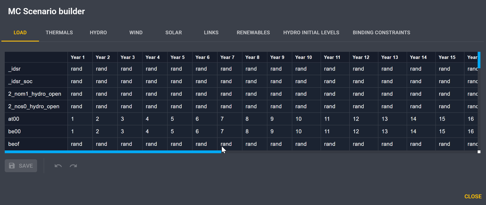

# Use the scenario builder

The scenario builder allows to state whether the values of a time series 
should be randomly drawn from the available set or should take a user defined value.
This choice can be made for each type of time series and each year of simulations.
It could be useful for example to give more probability to selected series, 
to allow only realistic matching series...

To build your own scenario, in the **Configuration** > **General** tab, 
select **Custom** in the **Build mode** dropdown menu.
Then click on :octicons-gear-24: **Settings** to open the following pop-up.

By default the choice is random (`rand`), but for each year you can enter a time series index
for a given data (Load, Thermal, Hydro...).

Moreover, you can create several rule sets to easily save your configuration.