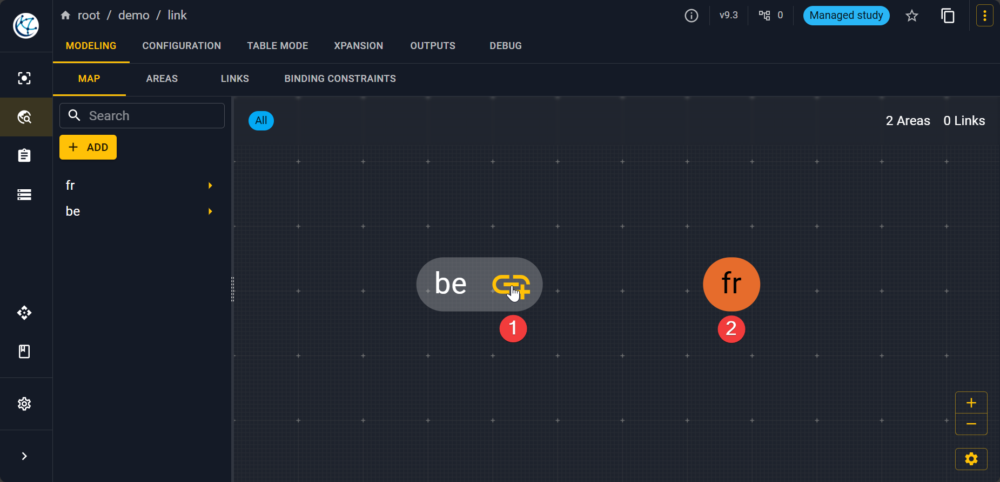

# Create links

## Create a link

Once you have created the two nodes on the graph, you have to click on the :material-link-plus: icon
of the first node that will become yellow then click on the second node. 

!!! note

	Links are directional, indeed in Antares the aggregation makes links directional.
    That's why you have to fill the direct and indirect capacity of the link.

To set the direct and indirect capacities go to **MODELING** > **LINKS** and select the link
that you want node_1 / node_2 in the left panels. Then go to **TIME SERIES** > **CAPACITIES**
and import the two different hourly capacities matrix.

## Delete a link

To delete a link, go to **MODELING** > **MAP** and then select an area concerned by the link.
On the left panel at the end should be listed all the links to and from this area.
Click on the desired link. Here you can delete the link by clicking on the trash icon
:fontawesome-solid-trash:.