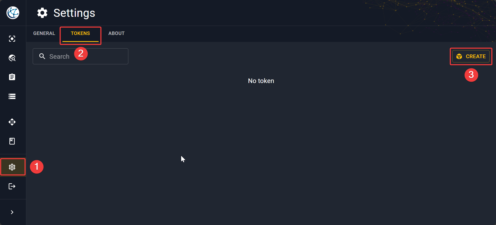

# Create a personal token

To have access to the Antares Web API when using the [base](../overview/deployment-options.md)
or [performance](../overview/deployment-options.md) version,
notably with Antares Craft, you will have to create your personal token inside the app. 
It is essentially a unique string that give you remote access to the API.

Go to :octicons-gear-24: **Settings** in the sidebar and click on the **Tokens** tab.
Then click on **Create**.

This will open a pop-up. Give a name to your token and then make sure to copy
and save your token in a safe place before closing the window. 

!!! warning
    If you lose the string once the token is created, you can't get back the string associated.
    However, you can delete the old token and create a new one.