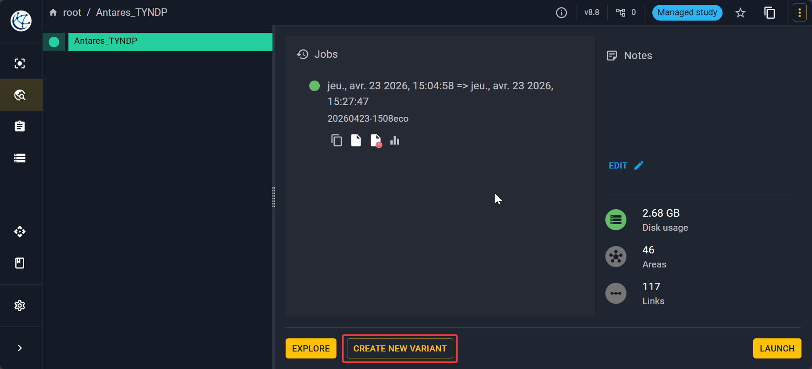
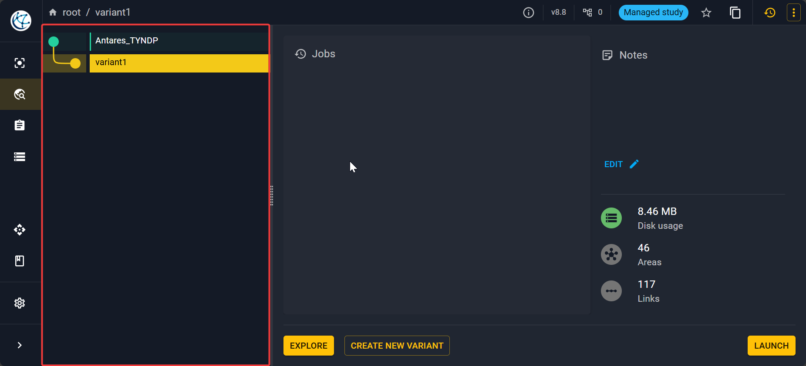
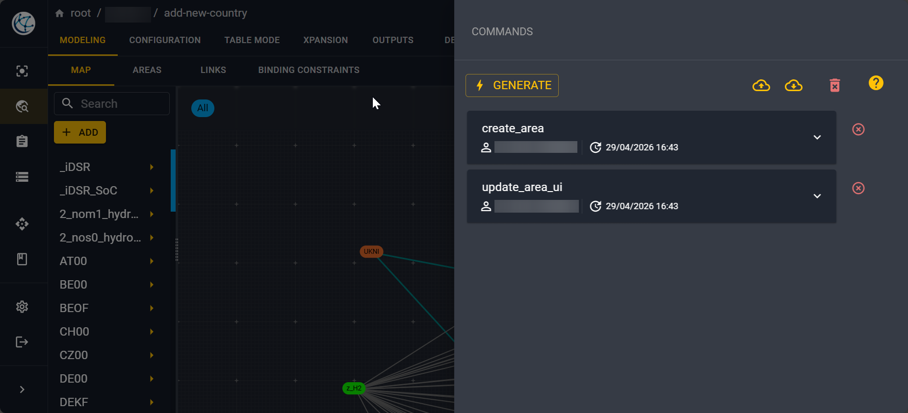

# Create a variant

## Why use a variant?

Variants are a great way to optimize your process workflow and memory. 
It is especially useful not to duplicate a whole study just to change a handful of settings.

You create a main study and then you can apply some small changes on your inputs. 
Then you can explore the impact of some changes on your study.

You can even create a large number of variants using 
[Antares Craft](https://antares-craft.readthedocs.io/en/latest/) 
to programmatically explore multiple configuration quicky.

!!! note
    From the point of view of the user, a variant behaves just like a duplication
    of the main study, you can see the parameters, time series, modify the settings...
    However, internally it is stored as a difference from the main study to avoid duplication.

## Create a variant

To create variant of a study first open your study and then click on the
**Create new variant** button in the bottom.

It will open a pop-up where you can fill the information that you want.
Then the new variant will be displayed inside the **Study variant tree**.

Then make sure you select the variant (or main study) and click explore to open the variant
(resp. the main study).

!!! tip
    You can create a variant of a variant and so on!

!!! note
    Each variant has its own study ID. 

## Variant manager and command history

Variants are defined by the collection of commands which change it from the parent study.​
You can see and edit each of these commands​ by clicking on the :material-history:
in the top right of the screen.

This will open a history of all the changes made on the variant and all the calls made to the API:

You can even access a JSON of the changes made on each command by expanding each API call.

!!! note
    Edit on commands are inherited to child variants​

## Delete a variant

Select the variant you want to delete in the study variant tree, then click on the 
:material-dots-vertical: in the top left of your screen to show the dropdown menu. 
Then click on :octicons-trash-16: **Delete**.

