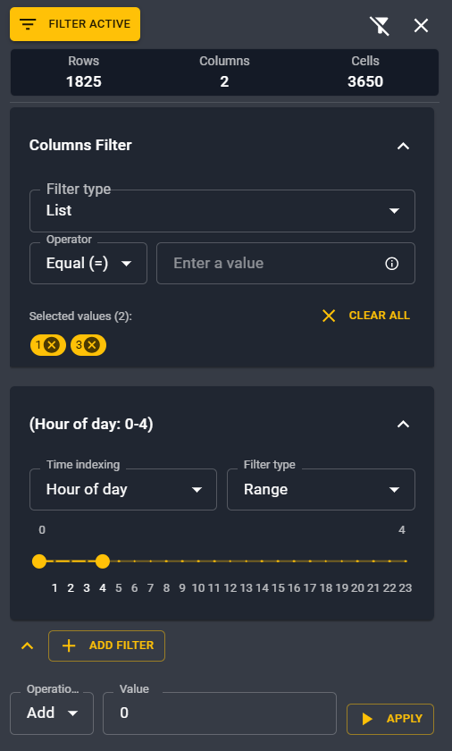

# Modify time series

Inside Antares Web, you can modify precisely and quickly time series to your need.
For that there are keyboard shortcuts and filters that you may find quite useful
without leaving the app.

!!! info "Copy/paste support from Excel"

    You can alternatively modify your time series inside a spreadsheet app or programmatically 
    and import/copy-paste it in Antares Web.

## Use keyboard shortcuts

To modify massively and effectively time series, you can use traditional keyboard shortcuts
used in various spreadsheets app. They are detailed in the [editing](./shortcuts.md#editing-shortcuts) 
section of the available shortcuts.

## Filter data for editing

You can also make use of the :octicons-filter-16: **Filter data** functionality for time series
modifications. This is a really powerful feature for modifying massively and precisely a time series
without going back and forth with your spreadsheet software.

It opens a right panel where you can make some filtering on the rows or the columns
at a given time indexing and for different values. 

{ width="400" }

!!! tip
    Don't forget to enable the filter once you have set the right one!

    { width="400" }

### Filter on columns

You can set some filters on columns (1-based numbering)
select a range of columns to make some modifications,
and then do some replace or basic math operations.

- List: you can input a list of non contiguous columns. For example to modify columns 1 and 3, 
  you can type 1, press enter and then type 3 and press enter. You will see your selection
  underneath the input field.
- Range: you can select a range of contiguous columns to modify.

Your selection will appear automatically next to the filter panel.

### Filter on rows

Additionally to filters on columns, you can mix them with one or multiple **Row filter**.
First you can select a time indexing on which you want to filter your values:

- Day of month
- Month
- Weekday
- Hour of day
- Week
- Hour of year

From that you can select a list or a range of these index with a different interface
adapted for the indexing.

### Edit the filtered values

Finally, you can do operations on the filtered values:

- Set value
- Add 
- Substract 
- Multiply
- Divide
- Absolute value

Click on the :material-play: **Apply** button to modify your selection.

!!! example

    If you want to set to null all values from 0 to 4 am in column 1 and 3.

    { width="400" }

