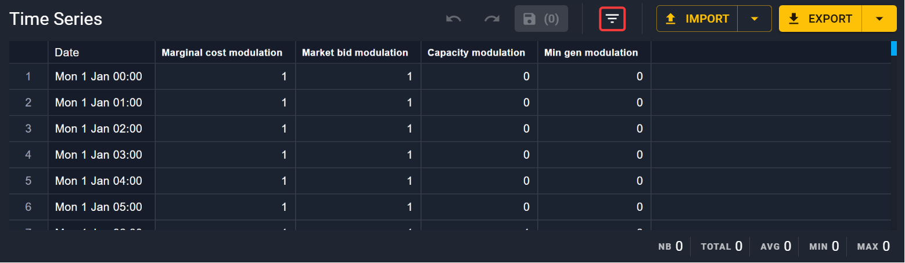
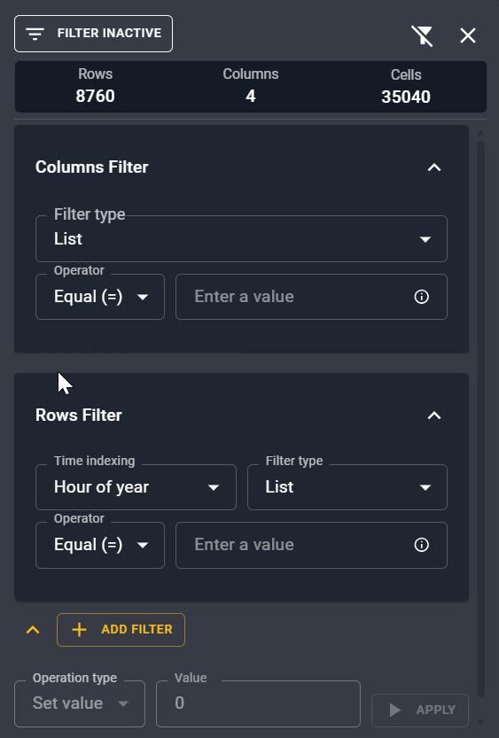
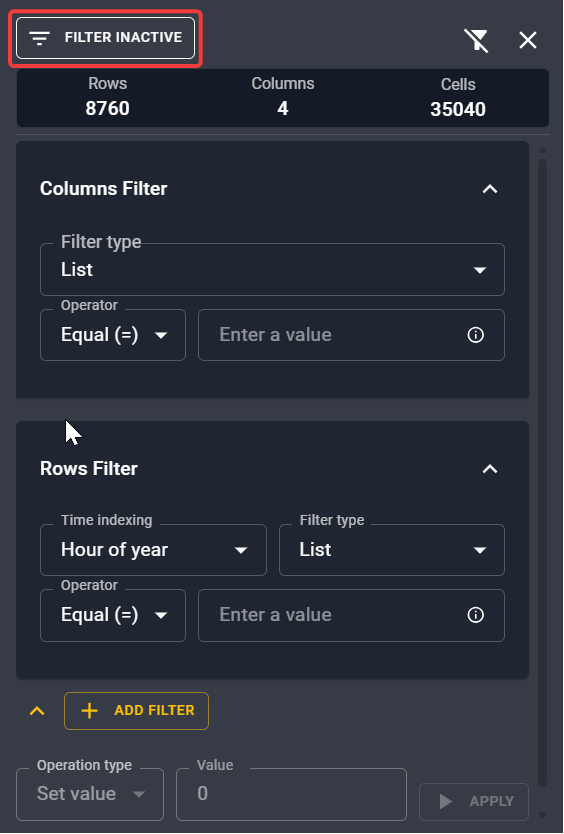

# Modify time series

## Use keyboard shortcuts

To modify massively and effectively time series, you can use traditional keyboard shortcuts
used in various spreadsheets app. They are detailed in the [editing](./shortcuts.md#editing-shortcuts) 
section of the available shortcuts.

## Filter data for editing

You can also make use of the :octicons-filter-16: **Filter data** functionality for time series
modifications.

It opens a right panel where you can make some filtering on the rows or the columns
at a given time indexing and for different values. 

{ width="400" }

!!! tip
    Don't forget to enable the filter once you have set the right one!

    { width="400" }

You can set some filters on columns, select a range of columns to make some modifications,
and then do some replace or basic math operations.

## Or inside your prefered software

You can alternatively modify your time series inside a spreadsheet app or programmatically 
and import it in Antares Web.