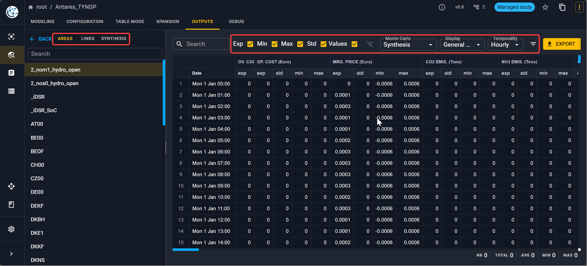

# Visualize Antares outputs

After running the simulation Antares offers you multiple way to display
the relevant metrics at a given time step, for each year or aggregated. 

## Output selectors

Here is the default view when you open the **Output** tab:

In the left panel, you have the possibilities to see outputs for:

- Areas
- Links
- Synthesis where you can find:
    - a **Digest** where you can see a summary of the simulation.
    - a **Thermal synthesis** with key indicators for each thermal cluster.

From the Monte-Carlo simulation, you have the possibility to see:

- The synthesis of all the simulated years with the average, min, max, variance or values
  for each variable. 
- The output year by year where you can select the year index. 
  Note that for a year to have an output, it should appear in the 
  [scenario playlist](./select-scenario.md).
- A variable per variable view where you can select the variables you want to see.

For each view, you can select the **Time step** to visualize the variables.

Besides, you can select what you want to display:

- General values
- Thermal plants
- Renewable clusters
- Record years
- Short term storages

