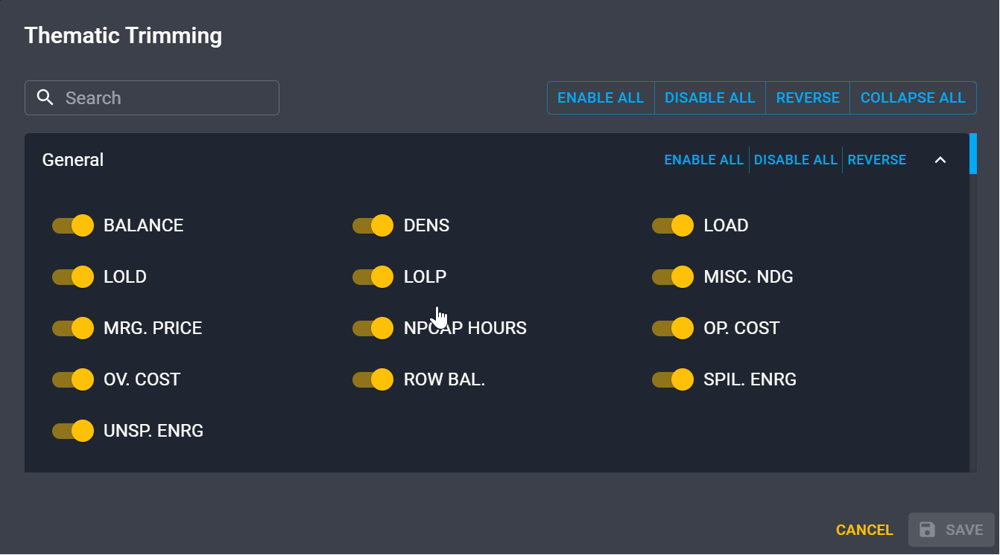

# Reduce your output size

Sometimes, it's useful to be able to restrict the amount of output results generated by Antares.
This is the goal of the **Thematic trimming**. 

!!! tip
    Use these features to reduce your memory footprint as studies can get quite heavy!
    This will also result in a [decrease of the simulation time](./reduce-simulation-time.md).

## Geographic trimming

In the **Configuration** > **General** tab, select **Custom** for the **Georgraphic trimming**.

<!-- TODO -->

!!! warning
    This section is under construction.

## Thematic trimming

To modify your selection of outputs, go to the **Configuration** > **General** tab
and then select **Custom** in the **Thematic trimming** dropdown menu.
Click on :fontawesome-solid-gear: **Settings** to open the following pop-up.

There you can enable or disable the different results that you want or don't want. 

!!! note
    By default, all the possible results are generated by Antares. 