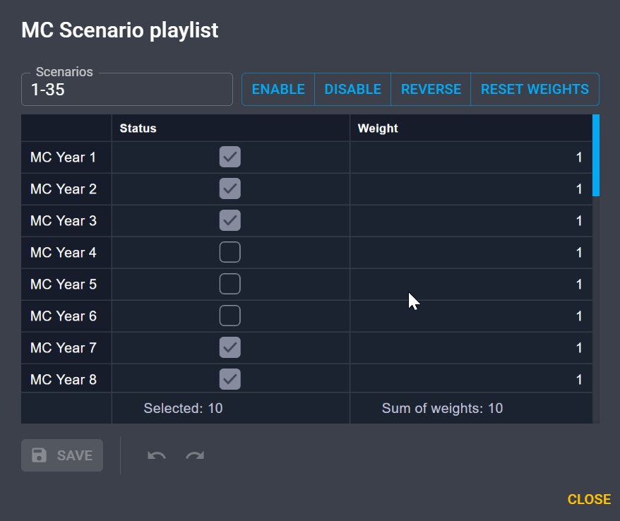

# Select scenarios

Sometimes you want to select some specific Monte-Carlo (MC) years for the simulation 
from all those prepared. For example to:

- Refine a previous simulation by excluding a small number of "raw" MC years 
  whose detailed analysis may have shown that they were not physically realistic.k
- Replay only a small number of years of specific interest
  (for instance, years where minimum or maximum values of a given variable 
  were encountered in a previous simulation)​.
- Run a set of representative years

You can access the scenario selector by going to **Configuration** > **General** tab.
In the section **Monte-Carlo Scenarios** select **Custom** in the **Selection mode** drop down menu.
Then click on :octicons-gear-24: **Settings** to open the following pop-up.

Here you can skip some years or make them active by changing their status
and apply a weight for each year. 
