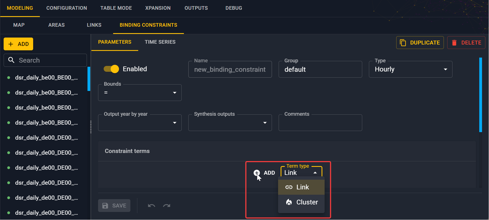

# Set binding constraints

To add additional constraints on your study that are not already implemented in Antares, 
you can specify some binding constraints. It is a linear combination of generation on clusters 
or on transmission in links that are bounded with a constant such as for each step $t$:

$$
\sum_i w_i a_{t-o_i} \text{ bounded by } c_t
$$

where:

- $w_i$ is a scalar weight
- $\text{bounded by}$ corresponds to the operators $=$, $<$, $>$ or $\neq$
- $o_i$ is an offset in the time step
- $t$ corresponds to the considered time step which can be hourly, daily or weekly
- $c_t$ is the right hand side of the constraint a scalar
- $a_{t - o_i}$ corresponds to the cluster or link term

## Left hand side

First, you need to create a new binding constraint in the **Modeling** > **Binding constraints** tab
by clicking on the :material-plus: **Add** button in the left panel.

Then, give it a name, a type (whether this constraint is on hourly, daily or weekly time step)
and a bound.

You will then have a similar view:

You have to create your linear combination corresponding to the left hand side of the constraint.
Set the weights, term (link or cluster), time offset. 

By choosing a link term, you want to constraint the transmission of the link between two areas
(directional link).
By choosing a cluster term, you want to contraint the generation of a cluster inside an area. 

## Right hand side

The right hand side of the constraint consisting of a column of values $(c_t)$.
You can add these in the **Time series** tab.

!!! note
    The length of this column depends on the time step of the binding constraints.

!!! info
    Check the reference section of the [binding constraints](../reference/binding-constraints.md)
    for more information