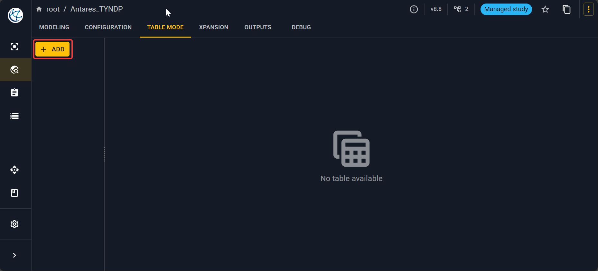
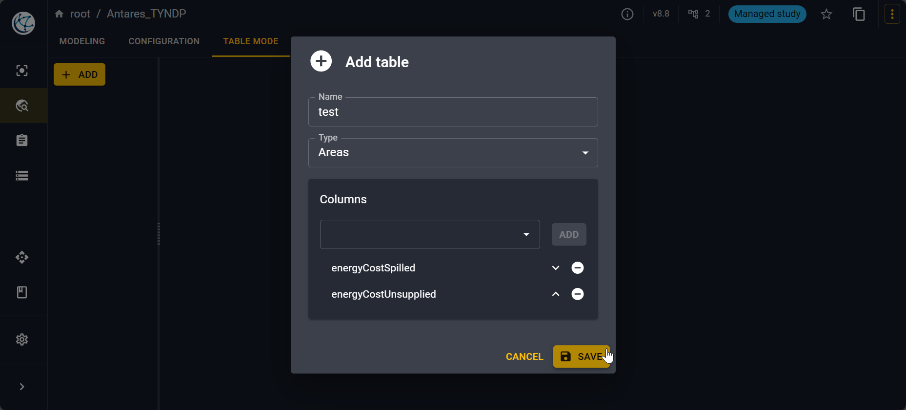
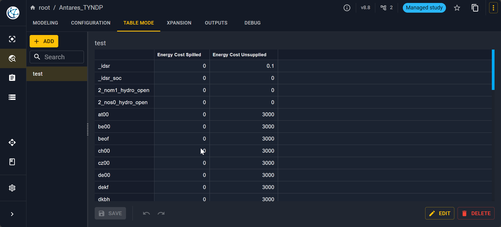

# Table mode

The table mode is a way to visualize a synthesis of your input variables.
It is especially useful to check the values of a specific parameter in each area of the study. 

## Table mode tab

First, you have to go into the **Table mode** tab, you will have an empty tab.

## Principle

Click on **Add** to open a pop-up. You will need to name your new table,
select an object type on which you want to make an aggregation of input variables.
You have the possibilities:

- Areas
- Links
- Thermals
- Renewables
- Short-term storages
- Binding constraints
- Additional constraints on short-term storages

Then, select the columns you want to see that is to say 
the input variables you want to see for each object type.
The list of available variables are displayed according the object type. 

## Simple example

For example, to see the spilled and unsupplied energy cost for each area:

You will then have the following view.

!!! note
    You can edit the values here also if you see that something is wrong.